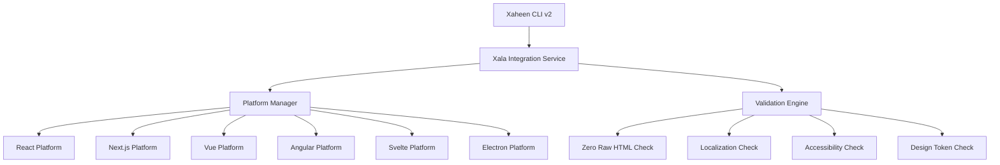

# Xala UI Integration

The Xala UI integration in Xaheen CLI v2 enables **semantic, multi-platform component generation** following the v5.0 architecture. This powerful integration bridges Xaheen's full-stack capabilities with Xala UI's enterprise-grade component system.

## Overview

### What is Xala UI Integration?

Xala UI Integration is a comprehensive system that:

- **Generates semantic components** across 6 platforms (React, Next.js, Vue, Angular, Svelte, Electron)
- **Enforces zero raw HTML policy** - no div, span, p, h1-h6 elements allowed
- **Mandates localization** - all text must use t() function
- **Ensures WCAG 2.2 AAA compliance** - accessibility by default
- **Uses design tokens exclusively** - consistent styling across platforms
- **Provides enterprise compliance** - meets Norwegian regulatory requirements

### Architecture Overview



## Quick Start

### 1. Initialize Xala UI Integration

Add Xala UI capabilities to your existing Xaheen project:

```bash
# Initialize Xala UI integration
xaheen add ui-integration --platform react --theme default

# Generate your first semantic component
xaheen add ui-component --name UserCard --platform react --stories --tests

# Validate semantic compliance
xaheen validate --ui --semantic --accessibility
```

### 2. Project Structure

After initialization, your project will have:

```
your-project/
├── xala.config.json          # Xala UI configuration
├── src/
│   ├── components/           # Generated semantic components
│   │   └── UserCard/
│   │       ├── UserCard.tsx  # Main component
│   │       ├── UserCard.test.tsx
│   │       ├── UserCard.stories.tsx
│   │       └── index.ts
│   └── i18n/                # Localization files
└── .xaheen/
    └── hooks/               # Integration hooks
```

## Core Features

### Zero Raw HTML Policy

All components must use semantic UI elements from `@xala-technologies/ui-system`:

```tsx
// ❌ FORBIDDEN - Raw HTML elements
<div className="card">
  <h1>Title</h1>
  <p>Content</p>
</div>

// ✅ REQUIRED - Semantic components
import { Container, Heading, Text } from '@xala-technologies/ui-system';

<Container variant="card">
  <Heading level={1}>Title</Heading>
  <Text>Content</Text>
</Container>
```

### Mandatory Localization

All text content must be localized using the t() function:

```tsx
// ❌ FORBIDDEN - Hardcoded text
<Button>Click me</Button>

// ✅ REQUIRED - Localized text
import { useTranslation } from 'react-i18next';

const { t } = useTranslation();
<Button>{t('actions.clickMe')}</Button>
```

### Design Token Usage

All styling must use design tokens, no hardcoded values:

```tsx
// ❌ FORBIDDEN - Hardcoded styles
<Button className="h-8 px-2 bg-blue-500">Small</Button>

// ✅ REQUIRED - Design tokens
<Button variant="primary" size="sm">Small</Button>
```

### WCAG 2.2 AAA Compliance

All components include proper accessibility attributes:

```tsx
// Generated component includes:
<Button
  aria-label={ariaLabel || t(titleKey)}
  aria-disabled={disabled}
  role="button"
  tabIndex={disabled ? -1 : 0}
>
  {children}
</Button>
```

## Platform Support

### React/Next.js

Generate React components with full TypeScript support:

```bash
# React component
xaheen add ui-component --name ProductCard --platform react

# Next.js component with internationalization
xaheen add ui-component --name ProductCard --platform nextjs --localized
```

**Features:**
- TypeScript with strict typing
- React hooks (useState, useEffect, useCallback)
- Class Variance Authority (CVA) for variants
- React Testing Library tests
- Storybook stories

### Vue 3

Generate Vue 3 components with Composition API:

```bash
# Vue component
xaheen add ui-component --name ProductCard --platform vue
```

**Features:**
- Vue 3 Composition API
- TypeScript support
- Vue i18n integration
- Vue Test Utils tests
- Storybook for Vue

### Angular

Generate Angular components with enterprise patterns:

```bash
# Angular component with module
xaheen add ui-component --name ProductCard --platform angular
```

**Features:**
- Angular 17+ standalone components
- NgRx integration ready
- Angular i18n support
- Jasmine/Karma tests
- Angular-specific Storybook

### Svelte

Generate Svelte components with modern patterns:

```bash
# Svelte component
xaheen add ui-component --name ProductCard --platform svelte
```

**Features:**
- Svelte 4+ with TypeScript
- Svelte stores integration
- Svelte i18n support
- Testing Library/Svelte

### Electron

Generate Electron-compatible React components:

```bash
# Electron desktop component
xaheen add ui-component --name ProductCard --platform electron
```

**Features:**
- React components optimized for Electron
- IPC-ready patterns
- Desktop-specific styling
- Main/renderer process separation

## Component Generation

### Basic Component Generation

```bash
# Generate a basic semantic component
xaheen add ui-component --name UserProfile

# Interactive mode with prompts
xaheen add ui-component --interactive
```

### Advanced Generation Options

```bash
# Full-featured component with everything
xaheen add ui-component \
  --name ProductGrid \
  --platform react \
  --type layout \
  --semantic \
  --localized \
  --accessible \
  --enterprise \
  --stories \
  --tests
```

### Batch Component Generation

```bash
# Generate multiple components
xaheen add ui-component --batch \
  --components "UserCard,ProductGrid,NavBar" \
  --platform react
```

## Validation & Compliance

### Semantic Validation

Validate your components against v5.0 architecture:

```bash
# Validate all components
xaheen validate --ui --semantic

# Validate specific component
xaheen validate --ui --file src/components/UserCard/UserCard.tsx

# Auto-fix validation issues
xaheen validate --ui --fix
```

### Compliance Checking

Ensure enterprise compliance requirements:

```bash
# Check WCAG AAA compliance
xaheen validate --compliance --wcag-aaa

# Norwegian regulatory compliance
xaheen validate --compliance --norwegian

# Full compliance audit
xaheen validate --compliance --audit --export-report
```

### Validation Results

The validation engine checks for:

- **Zero Raw HTML**: No div, span, p, h1-h6 elements
- **Localization**: All text uses t() function
- **Design Tokens**: No hardcoded styles or colors
- **Accessibility**: Proper ARIA labels and keyboard navigation
- **TypeScript**: Strict type safety
- **Enterprise**: Compliance-specific requirements

## Configuration

### xala.config.json

```json
{
  "name": "my-project",
  "version": "1.0.0",
  "type": "xaheen-integrated",
  "ui": {
    "system": "xala",
    "version": "5.0.0",
    "architecture": "semantic-v5",
    "theme": "default",
    "platform": "react",
    "compliance": ["wcag-aaa", "norwegian"],
    "localization": {
      "defaultLocale": "en",
      "supportedLocales": ["en", "nb-NO", "fr", "ar"]
    },
    "features": {
      "navbar": true,
      "dashboard": true,
      "semanticComponents": true,
      "designTokens": true
    }
  },
  "integrations": {
    "xaheen": {
      "enabled": true,
      "version": "2.0.0",
      "autoSync": true
    }
  }
}
```

### Environment Variables

```bash
# Xala UI configuration
XALA_UI_THEME=default
XALA_UI_PLATFORM=react
XALA_UI_COMPLIANCE=wcag-aaa,norwegian
XALA_UI_LOCALE=en

# Integration settings
XAHEEN_XALA_INTEGRATION=true
XAHEEN_AUTO_VALIDATE=true
```

## Migration Guide

### Migrating Existing Components

Convert your existing components to semantic architecture:

```bash
# Analyze existing components
xaheen validate --ui --analyze

# Create migration plan
xaheen migrate --ui --plan --backup

# Execute migration
xaheen migrate --ui --execute --force
```

### Migration Process

1. **Analysis**: Scan existing components for compliance issues
2. **Planning**: Generate migration strategy
3. **Backup**: Create safety backup of existing code
4. **Transform**: Convert components to semantic architecture
5. **Validate**: Ensure migrated components meet standards

## Best Practices

### Component Architecture

```tsx
// ✅ Ideal semantic component structure
import React from 'react';
import { cva, type VariantProps } from 'class-variance-authority';
import { cn } from '@xala-technologies/ui-system/utils';
import { useTranslation } from 'react-i18next';
import { Container, Heading, Text, Button } from '@xala-technologies/ui-system';

const userCardVariants = cva(
  "relative flex flex-col",
  {
    variants: {
      variant: {
        default: "bg-background border border-border",
        elevated: "bg-card shadow-lg border border-border",
        minimal: "bg-transparent border-none",
      },
      size: {
        sm: "p-4 gap-2",
        md: "p-6 gap-4",
        lg: "p-8 gap-6",
      }
    },
    defaultVariants: {
      variant: "default",
      size: "md",
    },
  }
);

interface UserCardProps extends React.HTMLAttributes<HTMLDivElement>, VariantProps<typeof userCardVariants> {
  readonly user: {
    name: string;
    email: string;
    avatar?: string;
  };
  readonly onEdit?: () => void;
}

export const UserCard = React.forwardRef<HTMLDivElement, UserCardProps>(({
  user,
  variant,
  size,
  onEdit,
  className,
  ...props
}, ref) => {
  const { t } = useTranslation();

  return (
    <Container
      ref={ref}
      className={cn(userCardVariants({ variant, size }), className)}
      role="article"
      aria-label={t('userCard.ariaLabel', { name: user.name })}
      {...props}
    >
      <Heading level={3} variant="card-title">
        {user.name}
      </Heading>
      
      <Text variant="muted">
        {user.email}
      </Text>
      
      {onEdit && (
        <Button
          variant="outline"
          size="sm"
          onClick={onEdit}
          aria-label={t('userCard.editButton', { name: user.name })}
        >
          {t('actions.edit')}
        </Button>
      )}
    </Container>
  );
});

UserCard.displayName = 'UserCard';
```

### Testing Standards

```tsx
// ✅ Comprehensive component testing
import { render, screen, fireEvent } from '@testing-library/react';
import { I18nextProvider } from 'react-i18next';
import { UserCard } from './UserCard';
import { createTestI18n } from '../../../test-utils/i18n';

const TestWrapper = ({ children }) => (
  <I18nextProvider i18n={createTestI18n()}>
    {children}
  </I18nextProvider>
);

describe('UserCard', () => {
  const mockUser = {
    name: 'John Doe',
    email: 'john@example.com'
  };

  it('meets accessibility requirements', () => {
    render(
      <TestWrapper>
        <UserCard user={mockUser} />
      </TestWrapper>
    );
    
    const card = screen.getByRole('article');
    expect(card).toHaveAttribute('aria-label', expect.stringContaining('John Doe'));
  });

  it('displays localized content', () => {
    render(
      <TestWrapper>
        <UserCard user={mockUser} onEdit={() => {}} />
      </TestWrapper>
    );
    
    expect(screen.getByText('Edit')).toBeInTheDocument();
  });

  it('handles keyboard navigation', () => {
    const handleEdit = jest.fn();
    render(
      <TestWrapper>
        <UserCard user={mockUser} onEdit={handleEdit} />
      </TestWrapper>
    );
    
    const editButton = screen.getByRole('button', { name: /edit/i });
    editButton.focus();
    fireEvent.keyDown(editButton, { key: 'Enter' });
    
    expect(handleEdit).toHaveBeenCalled();
  });
});
```

## Advanced Usage

### Custom Platform Creation

Create your own platform implementation:

```typescript
// custom-platform.ts
import { Platform, PlatformConfig } from '@xala-technologies/xaheen-cli';

export class CustomPlatform extends Platform {
  constructor() {
    super({
      name: 'custom',
      fileExtensions: {
        component: '.custom',
        test: '.test.custom',
        story: '.stories.custom'
      },
      templateDir: 'custom',
      outputDir: 'src/custom-components',
      // ... rest of config
    });
  }

  async generateComponent(spec, context) {
    // Your custom generation logic
  }
}
```

### Integration Hooks

Customize the integration process:

```bash
# .xaheen/hooks/pre-generate.sh
#!/bin/bash
echo "🎨 Pre-generation validation..."
xaheen validate --ui --pre-flight

# .xaheen/hooks/post-generate.sh  
#!/bin/bash
echo "✅ Post-generation cleanup..."
npm run format
npm run lint:fix
```

### Extending Validation Rules

Add custom validation rules:

```typescript
// custom-validators.ts
export const customValidators = {
  checkCustomRule: (content: string) => {
    const issues = [];
    
    // Your custom validation logic
    if (content.includes('forbidden-pattern')) {
      issues.push('Custom rule violation detected');
    }
    
    return issues;
  }
};
```

## Troubleshooting

### Common Issues

**Q: Components failing validation with "raw HTML" errors?**

A: Ensure all HTML elements are replaced with semantic components from `@xala-technologies/ui-system`.

**Q: Localization errors in generated components?**

A: Check that your i18n configuration matches the platform requirements and all text uses the t() function.

**Q: TypeScript errors in generated components?**

A: Verify that all required type dependencies are installed and your tsconfig.json includes the component directories.

**Q: Tests failing with "component not found" errors?**

A: Ensure test utilities are properly configured and mocked i18n provider is set up correctly.

### Debug Mode

Enable debug logging for detailed information:

```bash
# Enable debug mode
DEBUG=xaheen:xala-ui xaheen add ui-component --name Debug

# Verbose validation output
xaheen validate --ui --verbose --debug
```

### Support

- **Documentation**: [xaheen.dev/docs/xala-ui](https://xaheen.dev/docs/xala-ui)
- **GitHub Issues**: [github.com/xala-technologies/xaheen-cli/issues](https://github.com/xala-technologies/xaheen-cli/issues)
- **Discord Community**: [discord.gg/xaheen](https://discord.gg/xaheen)
- **Enterprise Support**: enterprise@xala.no

## Changelog

### v2.0.0 (Latest)

- ✅ Complete Xala UI v5.0 architecture support
- ✅ Multi-platform component generation (6 platforms)
- ✅ Zero raw HTML policy enforcement
- ✅ Mandatory localization validation
- ✅ WCAG 2.2 AAA compliance checking
- ✅ Enterprise compliance features
- ✅ Advanced validation engine
- ✅ Migration tools for existing projects

### Roadmap

- 🔄 Figma integration for design-to-code workflow
- 🔄 AI-powered component suggestions
- 🔄 Advanced compliance reporting
- 🔄 Multi-theme support
- 🔄 Component marketplace integration