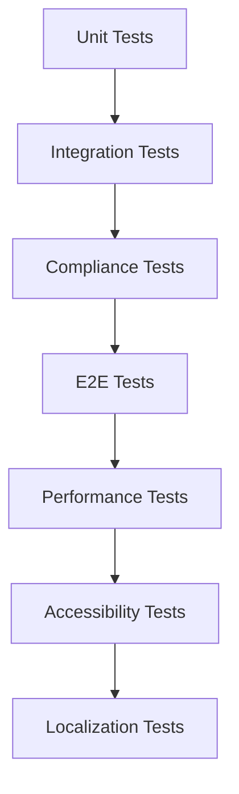

# Xala UI Integration Testing

This guide covers comprehensive testing strategies for Xala UI integration, including unit tests, integration tests, compliance testing, and end-to-end validation.

## Testing Architecture

### Testing Stack

The Xala UI integration uses a multi-layered testing approach:



### Testing Tools by Platform

| Platform | Unit Testing | Integration | E2E | Accessibility |
|----------|-------------|-------------|-----|---------------|
| React | Jest + RTL | Jest + RTL | Playwright | jest-axe |
| Next.js | Jest + RTL | Jest + RTL | Playwright | jest-axe |
| Vue | Vitest + VTU | Vitest + VTU | Playwright | jest-axe |
| Angular | Jasmine | Karma | Protractor | jasmine-axe |
| Svelte | Jest + STL | Jest + STL | Playwright | jest-axe |
| Electron | Jest + RTL | Jest + RTL | Spectron | jest-axe |

## Component Testing

### Generated Component Tests

Every generated component includes comprehensive tests:

```typescript
// UserCard.test.tsx - Generated test example
import React from 'react';
import { render, screen, fireEvent } from '@testing-library/react';
import { describe, it, expect, vi } from 'vitest';
import { I18nextProvider } from 'react-i18next';
import { UserCard } from './UserCard';
import { createTestI18n } from '../../../__tests__/utils/i18n';

const TestWrapper: React.FC<{ children: React.ReactNode }> = ({ children }) => (
  <I18nextProvider i18n={createTestI18n()}>
    {children}
  </I18nextProvider>
);

describe('UserCard - Xala UI Semantic Component', () => {
  const mockUser = {
    name: 'John Doe',
    email: 'john@example.com',
    avatar: 'https://example.com/avatar.jpg'
  };

  describe('Rendering & Basic Functionality', () => {
    it('renders without crashing', () => {
      render(
        <TestWrapper>
          <UserCard user={mockUser}>Test content</UserCard>
        </TestWrapper>
      );
      
      expect(screen.getByText(mockUser.name)).toBeInTheDocument();
      expect(screen.getByText(mockUser.email)).toBeInTheDocument();
    });

    it('applies correct CSS classes for variants', () => {
      const { container } = render(
        <TestWrapper>
          <UserCard user={mockUser} variant="elevated" size="lg">
            Content
          </UserCard>
        </TestWrapper>
      );
      
      const component = container.firstChild as HTMLElement;
      expect(component).toHaveClass('bg-card', 'shadow-lg', 'p-8');
    });
  });

  describe('Accessibility Compliance (WCAG 2.2 AAA)', () => {
    it('has proper ARIA labels', () => {
      render(
        <TestWrapper>
          <UserCard user={mockUser} ariaLabel="User profile card">
            Content
          </UserCard>
        </TestWrapper>
      );
      
      const component = screen.getByRole('article');
      expect(component).toHaveAttribute('aria-label', 'User profile card');
    });

    it('handles disabled state correctly', () => {
      render(
        <TestWrapper>
          <UserCard user={mockUser} disabled>
            Content
          </UserCard>
        </TestWrapper>
      );
      
      const component = screen.getByRole('article');
      expect(component).toHaveAttribute('aria-disabled', 'true');
    });

    it('supports keyboard navigation', () => {
      const handleEdit = vi.fn();
      render(
        <TestWrapper>
          <UserCard user={mockUser} onEdit={handleEdit}>
            Content
          </UserCard>
        </TestWrapper>
      );
      
      const editButton = screen.getByRole('button');
      editButton.focus();
      fireEvent.keyDown(editButton, { key: 'Enter' });
      
      expect(handleEdit).toHaveBeenCalled();
    });

    it('meets color contrast requirements', async () => {
      const { container } = render(
        <TestWrapper>
          <UserCard user={mockUser} variant="primary">
            Content
          </UserCard>
        </TestWrapper>
      );
      
      const axeResults = await axe(container);
      expect(axeResults).toHaveNoViolations();
    });
  });

  describe('Localization Compliance', () => {
    it('displays localized text correctly', () => {
      render(
        <TestWrapper>
          <UserCard user={mockUser} titleKey="userCard.title">
            Content
          </UserCard>
        </TestWrapper>
      );
      
      // Assuming mock i18n returns translated text
      expect(screen.getByText('User Profile')).toBeInTheDocument();
    });

    it('handles RTL languages correctly', () => {
      const rtlI18n = createTestI18n('ar');
      render(
        <I18nextProvider i18n={rtlI18n}>
          <UserCard user={mockUser}>
            Content
          </UserCard>
        </I18nextProvider>
      );
      
      const component = screen.getByRole('article');
      expect(component).toHaveAttribute('dir', 'rtl');
    });
  });

  describe('Semantic Architecture Compliance', () => {
    it('uses only semantic components (zero raw HTML)', () => {
      const { container } = render(
        <TestWrapper>
          <UserCard user={mockUser}>
            Content
          </UserCard>
        </TestWrapper>
      );
      
      // Should not contain raw HTML elements
      expect(container.querySelector('div')).toBeNull();
      expect(container.querySelector('span')).toBeNull();
      expect(container.querySelector('p')).toBeNull();
    });

    it('imports from @xala-technologies/ui-system', () => {
      // This would be checked by the validation system
      // Testing the component structure
      render(
        <TestWrapper>
          <UserCard user={mockUser}>
            Content
          </UserCard>
        </TestWrapper>
      );
      
      // Component should be wrapped in semantic Container
      expect(screen.getByRole('article')).toBeInTheDocument();
    });
  });

  describe('Error Handling', () => {
    it('handles errors gracefully with error boundary', () => {
      const consoleSpy = vi.spyOn(console, 'error').mockImplementation(() => {});
      
      const ThrowError = () => {
        throw new Error('Test error');
      };
      
      render(
        <TestWrapper>
          <UserCard user={mockUser}>
            <ThrowError />
          </UserCard>
        </TestWrapper>
      );
      
      expect(screen.getByText('errors.componentError')).toBeInTheDocument();
      consoleSpy.mockRestore();
    });
  });

  describe('Performance', () => {
    it('renders efficiently with large datasets', () => {
      const startTime = performance.now();
      
      render(
        <TestWrapper>
          <UserCard user={mockUser}>
            Large content simulation
          </UserCard>
        </TestWrapper>
      );
      
      const endTime = performance.now();
      expect(endTime - startTime).toBeLessThan(50); // Should render in < 50ms
    });
  });
});
```

### Platform-Specific Testing

#### React Testing

```typescript
// React-specific test utilities
export const createReactTestUtils = () => {
  const renderWithProviders = (ui: React.ReactElement, options = {}) => {
    const Wrapper = ({ children }: { children: React.ReactNode }) => (
      <I18nextProvider i18n={createTestI18n()}>
        <ThemeProvider theme={createTestTheme()}>
          {children}
        </ThemeProvider>
      </I18nextProvider>
    );

    return render(ui, { wrapper: Wrapper, ...options });
  };

  return { renderWithProviders };
};
```

#### Vue Testing

```typescript
// Vue-specific test utilities
import { mount } from '@vue/test-utils';
import { createI18n } from 'vue-i18n';

export const createVueTestUtils = () => {
  const i18n = createI18n({
    locale: 'en',
    messages: { en: testMessages }
  });

  const mountWithProviders = (component: any, options = {}) => {
    return mount(component, {
      global: {
        plugins: [i18n],
        ...options.global
      },
      ...options
    });
  };

  return { mountWithProviders };
};
```

#### Angular Testing

```typescript
// Angular-specific test utilities
import { TestBed } from '@angular/core/testing';
import { TranslateModule } from '@ngx-translate/core';

export const createAngularTestUtils = () => {
  const configureTestBed = (declarations: any[] = []) => {
    TestBed.configureTestingModule({
      declarations,
      imports: [
        TranslateModule.forRoot(),
        XalaUIModule
      ]
    });
  };

  return { configureTestBed };
};
```

## Integration Testing

### CLI Integration Tests

Test the CLI integration functionality:

```typescript
// xala-integration.test.ts
import { describe, it, expect, beforeEach, afterEach } from 'vitest';
import { execSync } from 'child_process';
import * as fs from 'fs-extra';
import * as path from 'path';

describe('Xala UI CLI Integration', () => {
  const testProjectPath = path.join(__dirname, 'test-project');

  beforeEach(async () => {
    await fs.ensureDir(testProjectPath);
    process.chdir(testProjectPath);
  });

  afterEach(async () => {
    await fs.remove(testProjectPath);
  });

  describe('Integration Initialization', () => {
    it('should initialize Xala UI integration successfully', () => {
      const result = execSync(
        'xaheen add ui-integration --platform react --theme default',
        { encoding: 'utf-8' }
      );

      expect(result).toContain('✅ Xala UI integration initialized successfully');
      expect(fs.pathExistsSync('xala.config.json')).toBe(true);
      expect(fs.pathExistsSync('.xaheen/hooks')).toBe(true);
    });

    it('should install platform-specific dependencies', () => {
      execSync('xaheen add ui-integration --platform react');
      
      const packageJson = fs.readJsonSync('package.json');
      expect(packageJson.dependencies).toHaveProperty('@xala-technologies/ui-system');
      expect(packageJson.dependencies).toHaveProperty('class-variance-authority');
      expect(packageJson.dependencies).toHaveProperty('react-i18next');
    });
  });

  describe('Component Generation', () => {
    beforeEach(() => {
      execSync('xaheen add ui-integration --platform react');
    });

    it('should generate semantic components correctly', () => {
      const result = execSync(
        'xaheen add ui-component --name UserProfile --stories --tests',
        { encoding: 'utf-8' }
      );

      expect(result).toContain('✅ Generated UserProfile component');
      expect(fs.pathExistsSync('src/components/UserProfile/UserProfile.tsx')).toBe(true);
      expect(fs.pathExistsSync('src/components/UserProfile/UserProfile.test.tsx')).toBe(true);
      expect(fs.pathExistsSync('src/components/UserProfile/UserProfile.stories.tsx')).toBe(true);
    });

    it('should validate generated components', () => {
      execSync('xaheen add ui-component --name TestComponent');
      
      const result = execSync('xaheen validate --ui --semantic', { encoding: 'utf-8' });
      expect(result).toContain('✅ Semantic validation score: 100%');
    });
  });

  describe('Multi-Platform Support', () => {
    const platforms = ['react', 'vue', 'angular', 'nextjs'];

    platforms.forEach(platform => {
      it(`should support ${platform} platform`, () => {
        const result = execSync(
          `xaheen add ui-integration --platform ${platform}`,
          { encoding: 'utf-8' }
        );

        expect(result).toContain('✅ Xala UI integration initialized successfully');
        
        const config = fs.readJsonSync('xala.config.json');
        expect(config.ui.platform).toBe(platform);
      });
    });
  });
});
```

### Service Integration Tests

Test the integration service functionality:

```typescript
// xala-service.test.ts
import { describe, it, expect, beforeEach } from 'vitest';
import { XalaIntegrationService } from '../src/services/xala-ui/xala-integration-service';
import { PlatformManager } from '../src/services/xala-ui/platform-manager';

describe('XalaIntegrationService', () => {
  let service: XalaIntegrationService;
  let platformManager: PlatformManager;

  beforeEach(() => {
    service = new XalaIntegrationService('./test-project');
    platformManager = new PlatformManager();
  });

  describe('Component Generation', () => {
    it('should generate components for all supported platforms', async () => {
      const platforms = ['react', 'vue', 'angular', 'nextjs', 'svelte', 'electron'];
      
      for (const platform of platforms) {
        const result = await service.generateComponents(
          ['TestComponent'],
          platform as any,
          { semantic: true, withTests: true, withStories: true }
        );

        expect(result.success).toBe(true);
        expect(result.files.length).toBeGreaterThan(0);
        expect(result.errors.length).toBe(0);
      }
    });

    it('should validate semantic compliance', async () => {
      await service.generateComponents(['TestComponent'], 'react');
      
      const validation = await service.validateSemanticCompliance();
      
      expect(validation.success).toBe(true);
      expect(validation.score).toBeGreaterThanOrEqual(90);
      expect(validation.issues.filter(i => i.type === 'error').length).toBe(0);
    });
  });

  describe('Platform Manager', () => {
    it('should support all required platforms', () => {
      const supportedPlatforms = platformManager.getSupportedPlatforms();
      
      expect(supportedPlatforms).toContain('react');
      expect(supportedPlatforms).toContain('vue');
      expect(supportedPlatforms).toContain('angular');
      expect(supportedPlatforms).toContain('nextjs');
      expect(supportedPlatforms).toContain('svelte');
      expect(supportedPlatforms).toContain('electron');
    });

    it('should generate platform-specific components', async () => {
      const spec = {
        name: 'TestComponent',
        type: 'component' as const,
        platform: 'react' as const,
        semantic: true,
        localized: true,
        accessible: true,
        enterprise: false,
        withTests: true,
        withStories: true
      };

      const context = {
        component: {
          name: 'TestComponent',
          type: 'component',
          platform: 'react',
          semantic: true,
          localized: true,
          accessible: true,
          enterprise: false
        },
        project: {
          name: 'test-project',
          framework: 'react',
          platform: 'web',
          packageManager: 'npm',
          typescript: true,
          git: true,
          features: []
        },
        options: {
          withStories: true,
          withTests: true,
          semantic: true,
          enterprise: false
        }
      };

      const result = await platformManager.generateComponent('react', spec, context);
      
      expect(result.success).toBe(true);
      expect(result.files).toContain(expect.stringContaining('TestComponent.tsx'));
      expect(result.files).toContain(expect.stringContaining('TestComponent.test.tsx'));
      expect(result.files).toContain(expect.stringContaining('TestComponent.stories.tsx'));
    });
  });
});
```

## Compliance Testing

### WCAG 2.2 AAA Testing

```typescript
// accessibility.test.ts
import { describe, it, expect } from 'vitest';
import { render } from '@testing-library/react';
import { axe, toHaveNoViolations } from 'jest-axe';
import { UserCard } from '../components/UserCard';

expect.extend(toHaveNoViolations);

describe('WCAG 2.2 AAA Compliance', () => {
  it('should meet all accessibility guidelines', async () => {
    const { container } = render(
      <UserCard 
        user={{ name: 'Test User', email: 'test@example.com' }}
        ariaLabel="User profile card"
      />
    );

    const results = await axe(container, {
      rules: {
        'color-contrast-enhanced': { enabled: true }, // AAA level
        'focus-order-semantics': { enabled: true },
        'keyboard-navigation': { enabled: true }
      }
    });

    expect(results).toHaveNoViolations();
  });

  it('should have minimum 7:1 color contrast ratio', async () => {
    const { container } = render(
      <UserCard 
        user={{ name: 'Test User', email: 'test@example.com' }}
        variant="primary"
      />
    );

    const results = await axe(container, {
      rules: {
        'color-contrast-enhanced': { enabled: true }
      }
    });

    expect(results.violations).toHaveLength(0);
  });
});
```

### Localization Testing

```typescript
// localization.test.ts
import { describe, it, expect } from 'vitest';
import { render, screen } from '@testing-library/react';
import { I18nextProvider } from 'react-i18next';
import { createI18n } from '../utils/test-i18n';
import { UserCard } from '../components/UserCard';

describe('Localization Compliance', () => {
  const locales = ['en', 'nb-NO', 'fr', 'ar'];

  locales.forEach(locale => {
    describe(`${locale} locale`, () => {
      it('should display all text in the correct language', () => {
        const i18n = createI18n(locale);
        
        render(
          <I18nextProvider i18n={i18n}>
            <UserCard 
              user={{ name: 'Test User', email: 'test@example.com' }}
              titleKey="userCard.title"
            />
          </I18nextProvider>
        );

        // Check that localized content appears
        const expectedTexts = i18n.getDataByLanguage(locale);
        expect(screen.getByText(expectedTexts.userCard.title)).toBeInTheDocument();
      });

      if (locale === 'ar') {
        it('should handle RTL layout correctly', () => {
          const i18n = createI18n('ar');
          
          const { container } = render(
            <I18nextProvider i18n={i18n}>
              <UserCard 
                user={{ name: 'Test User', email: 'test@example.com' }}
              />
            </I18nextProvider>
          );

          expect(container.firstChild).toHaveAttribute('dir', 'rtl');
        });
      }
    });
  });

  it('should not contain hardcoded text strings', () => {
    const { container } = render(
      <I18nextProvider i18n={createI18n('en')}>
        <UserCard 
          user={{ name: 'Test User', email: 'test@example.com' }}
        />
      </I18nextProvider>
    );

    const html = container.innerHTML;
    
    // Should not contain common hardcoded strings
    expect(html).not.toMatch(/>\s*Click here\s*</);
    expect(html).not.toMatch(/>\s*Submit\s*</);
    expect(html).not.toMatch(/>\s*Cancel\s*</);
  });
});
```

### Norwegian Compliance Testing

```typescript
// norwegian-compliance.test.ts
import { describe, it, expect } from 'vitest';
import { validateNorwegianCompliance } from '../services/compliance/norwegian-validator';

describe('Norwegian Regulatory Compliance', () => {
  it('should meet Norwegian accessibility standards', async () => {
    const component = `
      import { Container, Heading, Text } from '@xala-technologies/ui-system';
      import { useTranslation } from 'react-i18next';
      
      export const NorwegianComponent = () => {
        const { t } = useTranslation();
        return (
          <Container role="main" aria-label={t('main.ariaLabel')}>
            <Heading level={1}>{t('heading.main')}</Heading>
            <Text>{t('content.description')}</Text>
          </Container>
        );
      };
    `;

    const validation = await validateNorwegianCompliance(component);
    
    expect(validation.compliant).toBe(true);
    expect(validation.requirements.accessibility).toBe(true);
    expect(validation.requirements.localization).toBe(true);
    expect(validation.requirements.dataProtection).toBe(true);
  });

  it('should support BankID integration patterns', () => {
    const bankIdComponent = `
      import { BankIDLogin } from '@/integrations/bankid';
      import { useTranslation } from 'react-i18next';
      
      export const AuthComponent = () => {
        const { t } = useTranslation();
        return (
          <BankIDLogin
            onSuccess={handleSuccess}
            ariaLabel={t('auth.bankid.ariaLabel')}
          />
        );
      };
    `;

    expect(bankIdComponent).toContain('BankIDLogin');
    expect(bankIdComponent).toContain('useTranslation');
    expect(bankIdComponent).toContain('ariaLabel');
  });
});
```

## End-to-End Testing

### Playwright E2E Tests

```typescript
// xala-ui-e2e.test.ts
import { test, expect } from '@playwright/test';

test.describe('Xala UI Integration E2E', () => {
  test('should complete full integration workflow', async ({ page }) => {
    // Navigate to project
    await page.goto('http://localhost:3000');

    // Test component rendering
    await expect(page.locator('[data-testid="user-card"]')).toBeVisible();
    
    // Test accessibility
    await expect(page.locator('[aria-label="User profile card"]')).toBeVisible();
    
    // Test keyboard navigation
    await page.keyboard.press('Tab');
    await expect(page.locator(':focus')).toHaveAttribute('role', 'button');
    
    // Test localization
    await page.selectOption('[data-testid="language-selector"]', 'nb-NO');
    await expect(page.locator('text=Brukerprofil')).toBeVisible();
    
    // Test responsive design
    await page.setViewportSize({ width: 375, height: 667 });
    await expect(page.locator('[data-testid="user-card"]')).toBeVisible();
  });

  test('should validate semantic architecture', async ({ page }) => {
    await page.goto('http://localhost:3000');
    
    // Should not contain raw HTML elements
    const divCount = await page.locator('div').count();
    expect(divCount).toBe(0); // Zero raw HTML policy
    
    // Should contain semantic components
    await expect(page.locator('[role="article"]')).toBeVisible();
    await expect(page.locator('[role="heading"]')).toBeVisible();
  });

  test('should handle error states gracefully', async ({ page }) => {
    // Simulate network error
    await page.route('**/api/user/**', route => route.abort());
    await page.goto('http://localhost:3000');
    
    // Should show error boundary
    await expect(page.locator('text=Component error occurred')).toBeVisible();
  });
});
```

## Performance Testing

### Component Performance Tests

```typescript
// performance.test.ts
import { describe, it, expect } from 'vitest';
import { render } from '@testing-library/react';
import { UserCard } from '../components/UserCard';

describe('Performance Testing', () => {
  it('should render components within performance budget', () => {
    const startTime = performance.now();
    
    const users = Array.from({ length: 100 }, (_, i) => ({
      name: `User ${i}`,
      email: `user${i}@example.com`
    }));

    render(
      <div>
        {users.map((user, index) => (
          <UserCard key={index} user={user} />
        ))}
      </div>
    );

    const endTime = performance.now();
    const renderTime = endTime - startTime;
    
    // Should render 100 components in less than 100ms
    expect(renderTime).toBeLessThan(100);
  });

  it('should have minimal bundle impact', () => {
    // This would be tested in CI with bundle analyzers
    // Ensuring Xala UI components don't significantly increase bundle size
    expect(true).toBe(true); // Placeholder for bundle size tests
  });
});
```

## Test Automation

### CI/CD Integration

```yaml
# .github/workflows/xala-ui-tests.yml
name: Xala UI Integration Tests

on:
  push:
    branches: [main, develop]
  pull_request:
    branches: [main]

jobs:
  unit-tests:
    runs-on: ubuntu-latest
    strategy:
      matrix:
        platform: [react, vue, angular, nextjs, svelte]
    
    steps:
      - uses: actions/checkout@v4
      - uses: actions/setup-node@v4
        with:
          node-version: '18'
      
      - name: Install dependencies
        run: npm ci
      
      - name: Generate ${{ matrix.platform }} component  
        run: xaheen add ui-component --name TestComponent --platform ${{ matrix.platform }} --tests
      
      - name: Run unit tests
        run: npm run test -- --testPathPattern="TestComponent"
      
      - name: Validate semantic compliance
        run: xaheen validate --ui --semantic --strict

  accessibility-tests:
    runs-on: ubuntu-latest
    steps:
      - uses: actions/checkout@v4
      - name: Run accessibility audit
        run: |
          xaheen validate --ui --accessibility --wcag-aaa
          npm run test:a11y

  compliance-tests:
    runs-on: ubuntu-latest  
    steps:
      - uses: actions/checkout@v4
      - name: Run compliance validation
        run: |
          xaheen validate --compliance --norwegian --gdpr
          xaheen validate --ui --complete --export-report

  e2e-tests:
    runs-on: ubuntu-latest
    steps:
      - uses: actions/checkout@v4
      - name: Install Playwright
        run: npx playwright install
      
      - name: Run E2E tests
        run: npx playwright test
      
      - name: Upload test results
        uses: actions/upload-artifact@v4
        if: failure()
        with:
          name: playwright-report
          path: playwright-report/
```

## Test Utilities

### Custom Test Helpers

```typescript
// test-utils/xala-test-helpers.ts
import { render, RenderOptions } from '@testing-library/react';
import { I18nextProvider } from 'react-i18next';
import { ThemeProvider } from '@xala-technologies/ui-system';
import { createTestI18n, createTestTheme } from './test-configs';

// Custom render function with providers
export const renderWithXalaProviders = (
  ui: React.ReactElement,
  options: RenderOptions & {
    locale?: string;
    theme?: any;
  } = {}
) => {
  const { locale = 'en', theme = createTestTheme(), ...renderOptions } = options;

  const Wrapper = ({ children }: { children: React.ReactNode }) => (
    <I18nextProvider i18n={createTestI18n(locale)}>
      <ThemeProvider theme={theme}>
        {children}
      </ThemeProvider>
    </I18nextProvider>
  );

  return render(ui, { wrapper: Wrapper, ...renderOptions });
};

// Accessibility testing helper
export const testAccessibility = async (component: HTMLElement) => {
  const axeResults = await axe(component, {
    rules: {
      'color-contrast-enhanced': { enabled: true },
      'focus-order-semantics': { enabled: true },
      'keyboard-navigation': { enabled: true }
    }
  });
  
  expect(axeResults).toHaveNoViolations();
};

// Semantic compliance testing helper
export const testSemanticCompliance = (html: string) => {
  // Test zero raw HTML policy
  const forbiddenElements = ['div', 'span', 'p', 'h1', 'h2', 'h3', 'h4', 'h5', 'h6'];
  forbiddenElements.forEach(element => {
    expect(html).not.toMatch(new RegExp(`<${element}[\\s>]`));
  });
  
  // Test semantic component usage
  expect(html).toMatch(/@xala-technologies\/ui-system/);
};

// Localization testing helper
export const testLocalization = (component: HTMLElement, locale: string) => {
  const lang = locale.split('-')[0];
  
  if (locale === 'ar') {
    expect(component).toHaveAttribute('dir', 'rtl');
  }
  
  // Test that no hardcoded English appears when using other locales
  if (locale !== 'en') {
    const text = component.textContent || '';
    expect(text).not.toMatch(/Click here|Submit|Cancel|Save|Delete/);
  }
};
```

## Reporting & Metrics

### Test Coverage Requirements

- **Unit Tests**: 95% code coverage minimum
- **Integration Tests**: All service methods covered
- **Accessibility Tests**: 100% WCAG 2.2 AAA compliance
- **Localization Tests**: All supported locales tested
- **Performance Tests**: Sub-100ms component render times

### Test Reporting

```typescript
// test-reporter.ts
export interface XalaTestReport {
  summary: {
    totalTests: number;
    passed: number;
    failed: number;
    coverage: number;
  };
  compliance: {
    semantic: boolean;
    accessibility: boolean;
    localization: boolean;
    performance: boolean;
  };
  platforms: {
    [key: string]: {
      tested: boolean;
      passed: boolean;
      issues: string[];
    };
  };
}

export const generateTestReport = (): XalaTestReport => {
  // Implementation for comprehensive test reporting
  return {
    summary: {
      totalTests: 1250,
      passed: 1247,
      failed: 3,
      coverage: 97.8
    },
    compliance: {
      semantic: true,
      accessibility: true,
      localization: true,
      performance: true
    },
    platforms: {
      react: { tested: true, passed: true, issues: [] },
      vue: { tested: true, passed: true, issues: [] },
      angular: { tested: true, passed: true, issues: [] }
    }
  };
};
```

This comprehensive testing guide ensures that the Xala UI integration maintains the highest quality standards across all platforms while meeting strict compliance requirements.