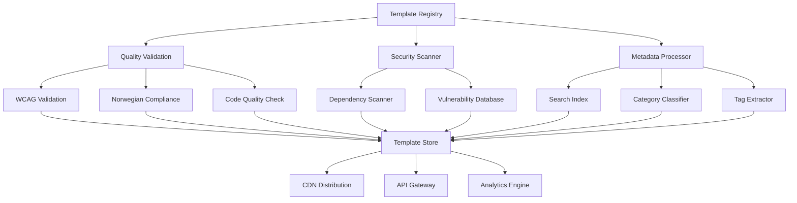

# Template Sharing Platform

The Xaheen CLI Template Sharing Platform is a community-driven ecosystem where developers can discover, share, and collaborate on high-quality templates. This platform ensures all shared templates meet our standards for accessibility, Norwegian compliance, and code quality.

## 🌟 Platform Overview

### Key Features

- 🔍 **Template Discovery**: Advanced search and filtering
- 📊 **Quality Metrics**: Automated quality scoring
- 🤝 **Community Reviews**: Peer review and rating system
- 🔄 **Version Management**: Template versioning and updates
- 📈 **Usage Analytics**: Download and usage statistics
- 🏆 **Recognition System**: Contributor achievements
- 🛡️ **Security Scanning**: Automated vulnerability detection

### Platform Architecture



## 🚀 Getting Started

### For Template Users

#### Discovering Templates

```bash
# Search for templates
xaheen search templates "button component"

# Filter by category
xaheen search templates --category=components --platform=react

# Filter by quality score
xaheen search templates --min-quality=8.5

# Filter by Norwegian compliance
xaheen search templates --norwegian-compliant=true

# View template details
xaheen template info @community/awesome-button
```

#### Using Community Templates

```bash
# Generate component from community template
xaheen generate component MyButton \
  --template=@community/awesome-button \
  --variant=primary

# Install template locally for repeated use
xaheen template install @community/awesome-button

# Use installed template
xaheen generate component MyButton --template=awesome-button
```

### For Template Contributors

#### Publishing Your First Template

```bash
# Create template account
xaheen auth login

# Validate template before publishing
xaheen template validate ./my-template

# Publish template
xaheen template publish ./my-template

# Update existing template
xaheen template publish ./my-template --version=1.1.0
```

#### Template Submission Process

1. **Local Development**: Create and test your template
2. **Validation**: Run automated quality checks
3. **Submission**: Publish to platform
4. **Review**: Community and automated review
5. **Approval**: Template becomes available
6. **Monitoring**: Track usage and feedback

## 🔍 Template Discovery System

### Advanced Search Features

The platform provides sophisticated search capabilities:

#### Search Interface

```typescript
interface TemplateSearch {
  query?: string;
  category?: TemplateCategory;
  platform?: SupportedPlatform[];
  features?: TemplateFeature[];
  qualityScore?: {
    min: number;
    max: number;
  };
  norwegianCompliant?: boolean;
  accessibility?: AccessibilityLevel;
  author?: string;
  tags?: string[];
  sortBy?: 'relevance' | 'quality' | 'downloads' | 'updated';
  limit?: number;
  offset?: number;
}
```

#### Search Examples

```bash
# Find accessible form templates
xaheen search templates \
  --query="form" \
  --features="accessibility,validation" \
  --min-quality=9.0

# Find Norwegian-compliant React components
xaheen search templates \
  --platform=react \
  --norwegian-compliant=true \
  --category=components

# Find templates by popular authors
xaheen search templates \
  --author="@xaheen-team" \
  --sort-by=downloads
```

### Template Categories

Templates are organized into categories:

#### Component Templates
- **Form Components**: Inputs, forms, validation
- **Navigation Components**: Menus, breadcrumbs, tabs
- **Data Display**: Tables, lists, cards
- **Feedback Components**: Alerts, toasts, modals
- **Interactive Components**: Buttons, toggles, sliders

#### Layout Templates
- **Page Layouts**: Dashboard, landing, auth pages
- **Section Layouts**: Headers, footers, sidebars
- **Grid Systems**: Responsive grids, flex layouts
- **Container Templates**: Wrappers, panels, boxes

#### Pattern Templates
- **CRUD Patterns**: Create, read, update, delete workflows
- **Authentication Patterns**: Login, signup, password reset
- **E-commerce Patterns**: Product lists, checkout, cart
- **Dashboard Patterns**: Analytics, admin panels
- **Content Patterns**: Blog, CMS, documentation

#### Platform-Specific Templates
- **React Templates**: React-specific optimizations
- **Vue Templates**: Vue 3 Composition API patterns
- **Angular Templates**: Angular Standalone components
- **Svelte Templates**: SvelteKit optimizations

## 📊 Quality Assurance System

### Automated Quality Scoring

Every template receives a quality score (0-10) based on:

#### Code Quality (30%)
- TypeScript usage and type safety
- ESLint compliance
- Code complexity metrics
- Error handling implementation
- Performance optimizations

#### Accessibility (25%)
- WCAG compliance level
- Screen reader compatibility
- Keyboard navigation support
- Color contrast validation
- Semantic HTML usage

#### Norwegian Compliance (20%)
- Localization support
- Government standard compliance
- Cultural appropriateness
- Legal requirement adherence

#### Testing (15%)
- Test coverage percentage
- Test quality and comprehensiveness
- Accessibility testing
- Cross-browser compatibility

#### Documentation (10%)
- README completeness
- API documentation quality
- Usage examples
- Inline code comments

### Quality Metrics Dashboard

```typescript
interface QualityMetrics {
  overall: number;           // 0-10 overall score
  codeQuality: number;       // Code quality subscore
  accessibility: number;     // Accessibility subscore
  compliance: number;        // Norwegian compliance subscore
  testing: number;          // Testing subscore
  documentation: number;     // Documentation subscore
  
  details: {
    typeScriptCoverage: number;
    wcagLevel: 'A' | 'AA' | 'AAA';
    testCoverage: number;
    vulnerabilities: number;
    performanceScore: number;
  };
}
```

### Continuous Quality Monitoring

Templates are continuously monitored for:

- **Security Vulnerabilities**: Dependency scanning
- **Performance Regressions**: Bundle size monitoring
- **Compatibility Issues**: Framework version updates
- **Accessibility Changes**: WCAG standard updates
- **Compliance Updates**: Norwegian regulation changes

## 🤝 Community Review System

### Peer Review Process

#### Review Stages

1. **Automated Review**: Technical validation and scoring
2. **Community Review**: Peer feedback and suggestions
3. **Expert Review**: Maintainer approval for high-impact templates
4. **Final Approval**: Template becomes available

#### Review Criteria

Reviewers evaluate templates on:

- **Functionality**: Does it work as advertised?
- **Code Quality**: Is it well-written and maintainable?
- **Accessibility**: Does it meet accessibility standards?
- **Compliance**: Does it support Norwegian requirements?
- **Usability**: Is it easy to use and understand?
- **Documentation**: Is it well-documented?

### Review Interface

```typescript
interface TemplateReview {
  templateId: string;
  reviewer: ReviewerInfo;
  overallRating: number;     // 1-5 stars
  ratings: {
    functionality: number;
    codeQuality: number;
    accessibility: number;
    compliance: number;
    usability: number;
    documentation: number;
  };
  feedback: string;
  suggestions: ReviewSuggestion[];
  approved: boolean;
  createdAt: Date;
}
```

### Community Feedback

Users can provide feedback through:

- **Star Ratings**: 1-5 star rating system
- **Written Reviews**: Detailed feedback and suggestions
- **Usage Reports**: Bug reports and improvement requests
- **Feature Requests**: Requests for new features or variants

## 🔄 Version Management

### Template Versioning

Templates follow semantic versioning (SemVer):

- **Major (1.0.0)**: Breaking changes to API or structure
- **Minor (1.1.0)**: New features, backward compatible
- **Patch (1.1.1)**: Bug fixes, no new features

### Version Management Commands

```bash
# Publish new version
xaheen template publish ./my-template --version=1.1.0

# List template versions
xaheen template versions @community/awesome-button

# Use specific version
xaheen generate component MyButton \
  --template=@community/awesome-button@1.0.0

# Update to latest version
xaheen template update awesome-button
```

### Deprecation Policy

- **Deprecation Notice**: 6-month advance notice
- **Migration Guide**: Provided for breaking changes
- **Legacy Support**: Maintained for 12 months
- **Automatic Updates**: Optional automatic updates

## 📈 Analytics and Insights

### Usage Analytics

Track template performance with:

#### Download Metrics
- Total downloads
- Weekly/monthly download trends
- Geographic distribution
- Platform breakdown

#### Usage Patterns
- Most generated variants
- Common customizations
- Error rates and issues
- User feedback patterns

#### Performance Metrics
- Generation time
- Bundle size impact
- Runtime performance
- Accessibility scores

### Analytics Dashboard

```typescript
interface TemplateAnalytics {
  downloads: {
    total: number;
    daily: number[];
    weekly: number[];
    monthly: number[];
  };
  
  usage: {
    platforms: Record<SupportedPlatform, number>;
    variants: Record<string, number>;
    customizations: CustomizationStats[];
  };
  
  quality: {
    userRating: number;
    qualityScore: number;
    issueCount: number;
    successRate: number;
  };
  
  geographic: {
    countries: Record<string, number>;
    regions: Record<string, number>;
  };
}
```

## 🛡️ Security and Trust

### Security Measures

#### Template Security Scanning

Every template is scanned for:

- **Dependency Vulnerabilities**: Known security issues
- **Code Injection Risks**: Potential XSS or injection attacks
- **Malicious Code**: Suspicious patterns or behavior
- **Privacy Violations**: Data collection or tracking

#### Security Scoring

```typescript
interface SecurityScore {
  overall: number;           // 0-10 security score
  vulnerabilities: {
    critical: number;
    high: number;
    medium: number;
    low: number;
  };
  dependencies: {
    total: number;
    outdated: number;
    vulnerable: number;
  };
  codeAnalysis: {
    suspiciousPatterns: number;
    unsafeFunctions: number;
    externalRequests: number;
  };
}
```

### Trust Indicators

Templates display trust indicators:

- **Verified Author**: Verified template authors
- **Security Scanned**: Passed security scanning
- **Quality Assured**: Met quality standards
- **Community Approved**: Peer-reviewed and approved
- **Actively Maintained**: Regular updates and maintenance

## 🏆 Recognition and Rewards

### Contributor Recognition

#### Achievement System

- **First Template**: Published your first template
- **Quality Master**: Achieved 9+ quality score
- **Accessibility Champion**: WCAG AAA compliance
- **Norwegian Expert**: Norwegian compliance specialist
- **Community Hero**: High community ratings
- **Power Contributor**: 10+ published templates

#### Leaderboards

- **Top Contributors**: Most published templates
- **Quality Leaders**: Highest average quality scores
- **Community Favorites**: Most downloaded templates
- **Rising Stars**: New contributors with high ratings

### Rewards Program

- **Swag Packages**: Branded merchandise
- **Conference Tickets**: Event sponsorship
- **Early Access**: Beta features and tools
- **Certification**: Official recognition
- **Speaking Opportunities**: Conference presentations

## 🔮 Platform Roadmap

### Current Features (v1.0)

- ✅ Template publishing and discovery
- ✅ Automated quality validation
- ✅ Community review system
- ✅ Basic analytics dashboard
- ✅ Security scanning

### Upcoming Features (v1.1)

- 🔄 Visual template builder
- 🔄 Real-time collaboration
- 🔄 Advanced analytics
- 🔄 Template marketplace
- 🔄 AI-powered recommendations

### Future Vision (v2.0)

- 🚀 Machine learning optimization
- 🚀 Automated template generation
- 🚀 Enterprise features
- 🚀 Global CDN distribution
- 🚀 Mobile app companion

## 🛠️ API Documentation

### Template Registry API

#### Search Templates

```http
GET /api/v1/templates/search
  ?q=button
  &category=components
  &platform=react
  &min-quality=8.0
  &norwegian-compliant=true
```

#### Get Template Details

```http
GET /api/v1/templates/@community/awesome-button
```

#### Publish Template

```http
POST /api/v1/templates
Content-Type: application/json
Authorization: Bearer <token>

{
  "name": "awesome-button",
  "version": "1.0.0",
  "files": [...],
  "metadata": {...}
}
```

#### Template Analytics

```http
GET /api/v1/templates/@community/awesome-button/analytics
Authorization: Bearer <token>
```

### Authentication API

```http
POST /api/v1/auth/login
Content-Type: application/json

{
  "email": "user@example.com",
  "password": "password"
}
```

## 💡 Best Practices

### For Template Authors

1. **Follow Naming Conventions**
   - Use descriptive names
   - Include primary purpose
   - Avoid generic terms

2. **Maintain High Quality**
   - Write comprehensive tests
   - Include accessibility features
   - Document thoroughly

3. **Engage with Community**
   - Respond to feedback
   - Update regularly
   - Help other contributors

### For Template Users

1. **Evaluate Before Using**
   - Check quality scores
   - Read reviews
   - Test in development

2. **Provide Feedback**
   - Rate templates
   - Report issues
   - Suggest improvements

3. **Stay Updated**
   - Monitor for updates
   - Migrate when necessary
   - Share experiences

## 📞 Support and Help

### Getting Help

- **Documentation**: [Platform docs](https://docs.xaheen.com/platform)
- **Community Forum**: [Discussions](https://github.com/xaheen/cli/discussions)
- **Discord Server**: [Real-time chat](https://discord.gg/xaheen)
- **Email Support**: [support@xaheen-ai.com](mailto:support@xaheen-ai.com)

### Reporting Issues

- **Template Issues**: Use template-specific issue tracker
- **Platform Bugs**: [Report here](https://github.com/xaheen/platform/issues)
- **Security Issues**: [security@xaheen-ai.com](mailto:security@xaheen-ai.com)
- **Abuse Reports**: [abuse@xaheen-ai.com](mailto:abuse@xaheen-ai.com)

---

**The Template Sharing Platform is the heart of the Xaheen CLI community. Join us in building the future of frontend development!**

🚀 **Ready to share your templates?** [Get started here](./your-first-template.md)