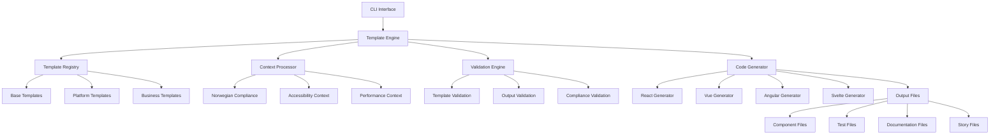
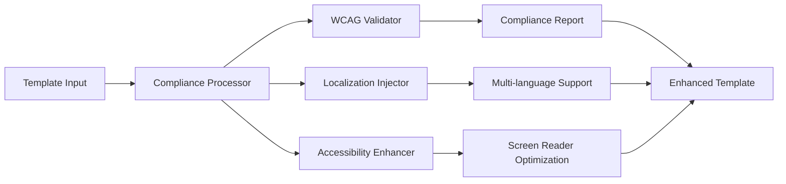
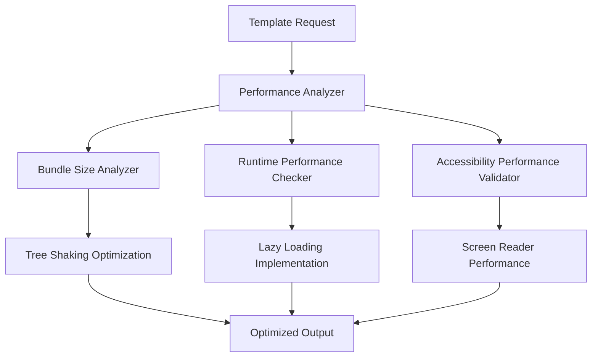

# Template System Architecture

## Overview

The Xaheen CLI template system is a comprehensive, modular architecture designed to generate high-quality, accessible, and compliant frontend components across multiple platforms.

## System Architecture Diagram



## Core Components

### 1. Template Engine

The central orchestrator that manages the entire generation process.

**Responsibilities:**
- Template selection and loading
- Context processing and injection
- Validation orchestration
- Code generation coordination

**Key Features:**
- Hot-swappable template loading
- Context-aware template selection
- Multi-platform output coordination
- Error recovery and reporting

### 2. Template Registry

A hierarchical system for organizing and accessing templates.

**Structure:**
```
Template Registry
├── Base Templates (Common patterns)
├── Platform Templates (React, Vue, Angular, etc.)
├── Business Templates (E-commerce, SaaS, etc.)
└── Custom Templates (User-defined)
```

**Features:**
- Inheritance-based template composition
- Dynamic template discovery
- Version management
- Dependency resolution

### 3. Context Processor

Enriches templates with contextual information for intelligent generation.

**Context Types:**
- **Norwegian Compliance Context**: WCAG, accessibility standards, localization
- **Business Context**: Industry-specific patterns and requirements
- **Platform Context**: Framework-specific optimizations
- **Performance Context**: Bundle size, loading optimizations

### 4. Validation Engine

Multi-layered validation system ensuring output quality and compliance.

**Validation Layers:**
1. **Template Validation**: Ensures template syntax and structure
2. **Output Validation**: Validates generated code quality
3. **Compliance Validation**: Checks Norwegian and accessibility compliance
4. **Performance Validation**: Analyzes bundle size and performance metrics

## Template Inheritance System

### Inheritance Hierarchy

```
BaseTemplate
├── ComponentTemplate
│   ├── ButtonTemplate
│   ├── FormTemplate
│   └── LayoutTemplate
├── PageTemplate
│   ├── DashboardTemplate
│   ├── AuthTemplate
│   └── LandingTemplate
└── PatternTemplate
    ├── CRUDPattern
    ├── AuthPattern
    └── E-commercePattern
```

### Inheritance Features

- **Property Inheritance**: Child templates inherit parent properties
- **Method Override**: Specialized behavior in child templates
- **Mixin Support**: Composable functionality modules
- **Dynamic Resolution**: Runtime template selection based on context

## Platform-Specific Generation

### Multi-Platform Architecture

```typescript
interface PlatformGenerator {
  readonly platform: SupportedPlatform;
  generateComponent(template: Template, context: GenerationContext): ComponentOutput;
  generateTests(component: ComponentOutput): TestOutput;
  generateStories(component: ComponentOutput): StoryOutput;
  generateDocs(component: ComponentOutput): DocumentationOutput;
}

type SupportedPlatform = 
  | 'react' 
  | 'nextjs' 
  | 'vue' 
  | 'angular' 
  | 'svelte' 
  | 'electron' 
  | 'react-native';
```

### Platform-Specific Optimizations

**React/Next.js:**
- Server-side rendering optimization
- React 18 concurrent features
- Next.js App Router compatibility

**Vue:**
- Composition API patterns
- Vue 3 reactivity system
- Nuxt.js compatibility

**Angular:**
- Standalone components
- Angular Signals integration
- Dependency injection patterns

**Svelte:**
- SvelteKit compatibility
- Reactive declarations
- Component lifecycle optimization

## Norwegian Compliance Integration

### Compliance Architecture



### Compliance Features

- **WCAG AAA Compliance**: Automated accessibility validation
- **Norwegian Language Support**: Built-in localization patterns
- **Government Standards**: Compliance with Norwegian digital standards
- **Screen Reader Optimization**: Enhanced semantic markup

## AI Optimization System

### AI-Enhanced Generation

```typescript
interface AIOptimizationEngine {
  analyzeContext(context: GenerationContext): AIInsights;
  optimizeTemplate(template: Template, insights: AIInsights): OptimizedTemplate;
  generateVariations(template: Template): TemplateVariation[];
  validateOutput(output: ComponentOutput): ValidationReport;
}
```

### AI Features

- **Context Analysis**: Intelligent pattern recognition
- **Template Optimization**: Performance and quality improvements
- **Variation Generation**: Multiple implementation approaches
- **Quality Assurance**: AI-powered code review

## Performance Optimization

### Performance Architecture



### Performance Features

- **Bundle Size Optimization**: Automatic tree shaking and code splitting
- **Runtime Performance**: Optimized component lifecycle
- **Accessibility Performance**: Screen reader and keyboard navigation optimization
- **Loading Performance**: Progressive enhancement and lazy loading

## Template Validation System

### Validation Pipeline

```typescript
interface ValidationPipeline {
  validateTemplate(template: Template): TemplateValidationResult;
  validateOutput(output: ComponentOutput): OutputValidationResult;
  validateCompliance(output: ComponentOutput): ComplianceValidationResult;
  validatePerformance(output: ComponentOutput): PerformanceValidationResult;
}
```

### Validation Stages

1. **Syntax Validation**: Template syntax and structure
2. **Semantic Validation**: Logical consistency and best practices
3. **Output Validation**: Generated code quality and standards
4. **Integration Validation**: Platform compatibility and dependencies

## Error Handling and Recovery

### Error Handling Architecture

```typescript
interface ErrorHandler {
  handleTemplateError(error: TemplateError): RecoveryStrategy;
  handleGenerationError(error: GenerationError): RecoveryStrategy;
  handleValidationError(error: ValidationError): RecoveryStrategy;
  generateErrorReport(errors: Error[]): ErrorReport;
}
```

### Recovery Strategies

- **Template Fallback**: Use base template when specialized template fails
- **Partial Generation**: Generate what's possible, report what failed
- **Context Adjustment**: Modify context to resolve generation issues
- **Manual Intervention**: Provide clear guidance for manual fixes

## Extension and Customization

### Plugin Architecture

```typescript
interface TemplatePlugin {
  readonly name: string;
  readonly version: string;
  install(registry: TemplateRegistry): void;
  uninstall(registry: TemplateRegistry): void;
}
```

### Customization Points

- **Custom Templates**: User-defined template creation
- **Custom Validators**: Additional validation rules
- **Custom Generators**: Platform-specific generation logic
- **Custom Context Processors**: Specialized context enhancement

## Configuration Management

### Configuration Hierarchy

```
Global Configuration
├── Platform Configuration
├── Project Configuration
├── Template Configuration
└── User Configuration
```

### Configuration Features

- **Hierarchical Override**: Lower levels override higher levels
- **Environment-Specific**: Different configs for dev/staging/production
- **Schema Validation**: Ensure configuration correctness
- **Hot Reloading**: Dynamic configuration updates

## Monitoring and Analytics

### System Monitoring

```typescript
interface SystemMonitor {
  trackGenerationMetrics(metrics: GenerationMetrics): void;
  trackPerformanceMetrics(metrics: PerformanceMetrics): void;
  trackUsagePatterns(patterns: UsagePattern[]): void;
  generateAnalyticsReport(): AnalyticsReport;
}
```

### Monitored Metrics

- **Generation Performance**: Template processing time
- **Output Quality**: Validation success rates
- **User Patterns**: Most used templates and configurations
- **Error Rates**: Common failure points and resolution time

## Security Considerations

### Security Architecture

- **Template Sandboxing**: Isolated template execution
- **Input Validation**: Sanitize all user inputs
- **Output Sanitization**: Clean generated code
- **Dependency Security**: Scan template dependencies

### Security Features

- **Code Injection Prevention**: Template execution in sandboxed environment
- **Dependency Scanning**: Automated vulnerability detection
- **Access Control**: Template access permissions
- **Audit Logging**: Track all template operations

## Future Architecture Considerations

### Planned Enhancements

- **Distributed Template Registry**: Cloud-based template sharing
- **Real-time Collaboration**: Multi-user template development
- **Advanced AI Integration**: Machine learning-powered optimizations
- **Visual Template Builder**: Drag-and-drop template creation

### Scalability Planning

- **Horizontal Scaling**: Distributed generation processing
- **Caching Strategy**: Template and output caching
- **Load Balancing**: Request distribution across generators
- **Database Optimization**: Efficient template storage and retrieval