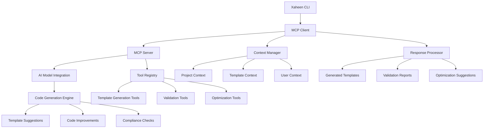

# MCP Integration Architecture

## Overview

The Model Context Protocol (MCP) integration provides intelligent, context-aware template generation powered by AI agents. This architecture enables seamless communication between the Xaheen CLI and AI models for enhanced development productivity.

## MCP Architecture Diagram



## Core Components

### 1. MCP Client

The client-side component that manages communication with MCP servers.

```typescript
interface MCPClient {
  connect(serverConfig: MCPServerConfig): Promise<void>;
  disconnect(): Promise<void>;
  sendRequest<T>(request: MCPRequest): Promise<MCPResponse<T>>;
  subscribeToTools(callback: ToolCallback): void;
  getAvailableTools(): Promise<MCPTool[]>;
}

interface MCPServerConfig {
  readonly name: string;
  readonly version: string;
  readonly endpoint: string;
  readonly authentication?: MCPAuthentication;
  readonly capabilities: MCPCapability[];
}
```

### 2. MCP Server

The server-side component that processes AI-powered template generation requests.

```typescript
interface MCPServer {
  initialize(config: ServerConfig): Promise<void>;
  registerTool(tool: MCPTool): void;
  handleRequest(request: MCPRequest): Promise<MCPResponse>;
  getServerInfo(): ServerInfo;
}

interface MCPTool {
  readonly name: string;
  readonly description: string;
  readonly inputSchema: JSONSchema;
  readonly outputSchema: JSONSchema;
  execute(input: unknown): Promise<unknown>;
}
```

### 3. Context Management System

Manages contextual information for intelligent template generation.

```typescript
interface ContextManager {
  collectProjectContext(projectPath: string): Promise<ProjectContext>;
  collectTemplateContext(templateName: string): Promise<TemplateContext>;
  collectUserContext(userId: string): Promise<UserContext>;
  mergeContexts(...contexts: Context[]): MergedContext;
}

interface ProjectContext {
  readonly framework: Framework;
  readonly dependencies: Dependency[];
  readonly configuration: ProjectConfiguration;
  readonly existingComponents: ComponentInfo[];
  readonly codebaseAnalysis: CodebaseAnalysis;
}
```

## MCP Tool Registry

### Template Generation Tools

#### 1. Component Generation Tool

```typescript
interface ComponentGenerationTool extends MCPTool {
  name: 'xaheen:generate:component';
  description: 'Generate components using Xaheen templates with AI optimization';
  
  input: {
    componentName: string;
    componentType: ComponentType;
    platform: SupportedPlatform;
    businessContext?: BusinessContext;
    customizations?: ComponentCustomizations;
  };
  
  output: {
    generatedFiles: GeneratedFile[];
    recommendations: AIRecommendation[];
    validationReport: ValidationReport;
  };
}
```

#### 2. Layout Generation Tool

```typescript
interface LayoutGenerationTool extends MCPTool {
  name: 'xaheen:generate:layout';
  description: 'Generate layout components with AI-powered structure optimization';
  
  input: {
    layoutType: LayoutType;
    sections: LayoutSection[];
    responsive: boolean;
    accessibility: AccessibilityLevel;
  };
  
  output: {
    layoutFiles: GeneratedFile[];
    structureAnalysis: StructureAnalysis;
    accessibilityReport: AccessibilityReport;
  };
}
```

#### 3. Form Generation Tool

```typescript
interface FormGenerationTool extends MCPTool {
  name: 'xaheen:generate:form';
  description: 'Generate forms with validation and Norwegian compliance';
  
  input: {
    formName: string;
    fields: FormField[];
    validationRules: ValidationRule[];
    norwegianCompliance: boolean;
  };
  
  output: {
    formFiles: GeneratedFile[];
    validationLogic: ValidationLogic;
    complianceReport: ComplianceReport;
  };
}
```

### Validation Tools

#### 1. Template Validation Tool

```typescript
interface TemplateValidationTool extends MCPTool {
  name: 'xaheen:validate:template';
  description: 'Validate templates for correctness and best practices';
  
  input: {
    templateContent: string;
    templateType: TemplateType;
    validationLevel: ValidationLevel;
  };
  
  output: {
    isValid: boolean;
    validationErrors: ValidationError[];
    suggestions: ValidationSuggestion[];
  };
}
```

#### 2. Accessibility Validation Tool

```typescript
interface AccessibilityValidationTool extends MCPTool {
  name: 'xaheen:validate:accessibility';
  description: 'Validate components for WCAG compliance and accessibility';
  
  input: {
    componentCode: string;
    wcagLevel: WCAGLevel;
    screenReaderTesting: boolean;
  };
  
  output: {
    complianceLevel: WCAGLevel;
    violations: AccessibilityViolation[];
    recommendations: AccessibilityRecommendation[];
  };
}
```

#### 3. Norwegian Compliance Validation Tool

```typescript
interface NorwegianComplianceValidationTool extends MCPTool {
  name: 'xaheen:validate:norwegian-compliance';
  description: 'Validate components for Norwegian digital standards compliance';
  
  input: {
    componentCode: string;
    complianceStandards: NorwegianStandard[];
    localizationRequired: boolean;
  };
  
  output: {
    complianceStatus: ComplianceStatus;
    violations: ComplianceViolation[];
    localizationReport: LocalizationReport;
  };
}
```

### Optimization Tools

#### 1. Performance Optimization Tool

```typescript
interface PerformanceOptimizationTool extends MCPTool {
  name: 'xaheen:optimize:performance';
  description: 'Optimize components for performance and bundle size';
  
  input: {
    componentCode: string;
    targetMetrics: PerformanceMetrics;
    optimizationLevel: OptimizationLevel;
  };
  
  output: {
    optimizedCode: string;
    performanceGains: PerformanceGains;
    recommendations: OptimizationRecommendation[];
  };
}
```

#### 2. Code Quality Optimization Tool

```typescript
interface CodeQualityOptimizationTool extends MCPTool {
  name: 'xaheen:optimize:quality';
  description: 'Optimize code quality and maintainability';
  
  input: {
    codeFiles: CodeFile[];
    qualityStandards: QualityStandard[];
    refactoringLevel: RefactoringLevel;
  };
  
  output: {
    optimizedFiles: CodeFile[];
    qualityMetrics: QualityMetrics;
    refactoringReport: RefactoringReport;
  };
}
```

## AI Model Integration

### Model Configuration

```typescript
interface AIModelConfig {
  readonly provider: 'openai' | 'anthropic' | 'google' | 'local';
  readonly model: string;
  readonly apiKey?: string;
  readonly endpoint?: string;
  readonly parameters: ModelParameters;
}

interface ModelParameters {
  readonly temperature: number;
  readonly maxTokens: number;
  readonly topP: number;
  readonly frequencyPenalty: number;
  readonly presencePenalty: number;
}
```

### Prompt Engineering

#### Template Generation Prompts

```typescript
interface TemplateGenerationPrompt {
  readonly systemPrompt: string;
  readonly contextPrompt: string;
  readonly instructionPrompt: string;
  readonly examplePrompts: ExamplePrompt[];
}

const COMPONENT_GENERATION_PROMPT: TemplateGenerationPrompt = {
  systemPrompt: `
    You are an expert frontend developer specializing in generating high-quality,
    accessible, and compliant React/TypeScript components using the Xaheen CLI template system.
    
    Always follow these principles:
    - TypeScript-first with strict type safety
    - WCAG AAA accessibility compliance
    - Norwegian digital standards compliance
    - Modern React patterns with hooks
    - Tailwind CSS for styling
    - Comprehensive error handling
  `,
  contextPrompt: 'Project Context: {{projectContext}}',
  instructionPrompt: 'Generate a {{componentType}} component named {{componentName}}',
  examplePrompts: [
    {
      input: 'Button component with variants',
      output: 'Generated button component with primary, secondary, destructive variants'
    }
  ]
};
```

### Response Processing

```typescript
interface ResponseProcessor {
  processGenerationResponse(response: AIResponse): ProcessedGeneration;
  processValidationResponse(response: AIResponse): ProcessedValidation;
  processOptimizationResponse(response: AIResponse): ProcessedOptimization;
  extractCodeBlocks(response: string): CodeBlock[];
  validateResponseStructure(response: AIResponse): boolean;
}

interface ProcessedGeneration {
  readonly generatedFiles: GeneratedFile[];
  readonly metadata: GenerationMetadata;
  readonly recommendations: AIRecommendation[];
  readonly warnings: GenerationWarning[];
}
```

## Context Collection and Analysis

### Project Context Collection

```typescript
interface ProjectContextCollector {
  analyzePackageJson(packageJsonPath: string): PackageAnalysis;
  analyzeTsConfig(tsConfigPath: string): TypeScriptConfig;
  analyzeComponents(componentsDir: string): ComponentAnalysis[];
  analyzeDependencies(lockFilePath: string): DependencyAnalysis;
  analyzeCodePatterns(sourceDir: string): PatternAnalysis;
}

interface PackageAnalysis {
  readonly framework: Framework;
  readonly dependencies: DependencyInfo[];
  readonly devDependencies: DependencyInfo[];
  readonly scripts: Record<string, string>;
  readonly engines: EngineRequirement[];
}
```

### Template Context Collection

```typescript
interface TemplateContextCollector {
  analyzeTemplateUsage(templateName: string): TemplateUsageAnalysis;
  collectTemplateVariations(templateName: string): TemplateVariation[];
  analyzeTemplatePerformance(templateName: string): TemplatePerformanceMetrics;
  collectUserFeedback(templateName: string): UserFeedback[];
}

interface TemplateUsageAnalysis {
  readonly usageCount: number;
  readonly successRate: number;
  readonly commonCustomizations: Customization[];
  readonly performanceMetrics: PerformanceMetrics;
}
```

## Error Handling and Recovery

### MCP Error Handling

```typescript
interface MCPErrorHandler {
  handleConnectionError(error: ConnectionError): Promise<void>;
  handleRequestError(error: RequestError): Promise<MCPResponse>;
  handleResponseError(error: ResponseError): Promise<void>;
  handleToolError(error: ToolError): Promise<void>;
}

enum MCPErrorType {
  CONNECTION_FAILED = 'connection_failed',
  REQUEST_TIMEOUT = 'request_timeout',
  INVALID_RESPONSE = 'invalid_response',
  TOOL_EXECUTION_FAILED = 'tool_execution_failed',
  AUTHENTICATION_FAILED = 'authentication_failed'
}
```

### Recovery Strategies

```typescript
interface RecoveryStrategy {
  retryWithBackoff(operation: () => Promise<void>, maxRetries: number): Promise<void>;
  fallbackToLocalGeneration(request: MCPRequest): Promise<LocalGenerationResult>;
  degradeGracefully(error: MCPError): Promise<DegradedResponse>;
  notifyUser(error: MCPError, recovery: RecoveryAction): void;
}
```

## Security and Privacy

### Security Measures

```typescript
interface MCPSecurity {
  authenticateRequest(request: MCPRequest): Promise<boolean>;
  sanitizeInput(input: unknown): SanitizedInput;
  validateResponse(response: MCPResponse): boolean;
  encryptSensitiveData(data: SensitiveData): EncryptedData;
}

interface SensitiveDataHandler {
  identifySensitiveData(content: string): SensitiveDataMatch[];
  redactSensitiveData(content: string): RedactedContent;
  logDataUsage(dataType: SensitiveDataType, action: DataAction): void;
}
```

### Privacy Protection

- **Data Minimization**: Only send necessary context to AI models
- **Sensitive Data Detection**: Automatically detect and redact sensitive information
- **Local Processing**: Option to process sensitive projects locally
- **Audit Logging**: Track all data access and processing

## Performance Optimization

### Caching Strategy

```typescript
interface MCPCache {
  cacheResponse(request: MCPRequest, response: MCPResponse): Promise<void>;
  getCachedResponse(request: MCPRequest): Promise<MCPResponse | null>;
  invalidateCache(pattern: string): Promise<void>;
  optimizeCache(): Promise<CacheOptimizationReport>;
}

interface CacheConfig {
  readonly ttl: number;
  readonly maxSize: number;
  readonly compressionEnabled: boolean;
  readonly encryptionEnabled: boolean;
}
```

### Request Optimization

```typescript
interface RequestOptimizer {
  batchRequests(requests: MCPRequest[]): BatchedRequest;
  compressRequest(request: MCPRequest): CompressedRequest;
  prioritizeRequests(requests: MCPRequest[]): PrioritizedRequest[];
  optimizeContext(context: Context): OptimizedContext;
}
```

## Monitoring and Analytics

### MCP Monitoring

```typescript
interface MCPMonitor {
  trackRequestLatency(requestId: string, latency: number): void;
  trackToolUsage(toolName: string, success: boolean): void;
  trackErrorRates(errorType: MCPErrorType, count: number): void;
  generateUsageReport(): MCPUsageReport;
}

interface MCPUsageReport {
  readonly totalRequests: number;
  readonly averageLatency: number;
  readonly errorRate: number;
  readonly mostUsedTools: ToolUsageStats[];
  readonly performanceMetrics: PerformanceMetrics;
}
```

## Configuration Management

### MCP Configuration

```typescript
interface MCPConfig {
  readonly servers: MCPServerConfig[];
  readonly client: MCPClientConfig;
  readonly security: MCPSecurityConfig;
  readonly performance: MCPPerformanceConfig;
}

interface MCPClientConfig {
  readonly timeout: number;
  readonly retryAttempts: number;
  readonly batchSize: number;
  readonly compressionEnabled: boolean;
}
```

## Testing and Quality Assurance

### MCP Testing

```typescript
interface MCPTester {
  testServerConnection(serverConfig: MCPServerConfig): Promise<ConnectionTestResult>;
  testToolExecution(toolName: string, testInput: unknown): Promise<ToolTestResult>;
  testResponseValidation(response: MCPResponse): Promise<ValidationTestResult>;
  runIntegrationTests(): Promise<IntegrationTestResult[]>;
}
```

### Quality Metrics

- **Response Accuracy**: Measure generated code quality
- **Performance Metrics**: Track response times and resource usage
- **Error Rates**: Monitor failure rates and recovery success
- **User Satisfaction**: Collect feedback on AI-generated content

## Future Enhancements

### Planned Features

- **Multi-Model Support**: Use multiple AI models for different tasks
- **Learning System**: Improve prompts based on user feedback
- **Collaborative AI**: Multi-agent systems for complex generation tasks
- **Visual Interface**: GUI for AI-assisted development

### Integration Roadmap

- **IDE Extensions**: Direct integration with popular IDEs
- **CI/CD Integration**: Automated code generation in pipelines
- **Team Collaboration**: Shared AI context and templates
- **Advanced Analytics**: Machine learning-powered insights