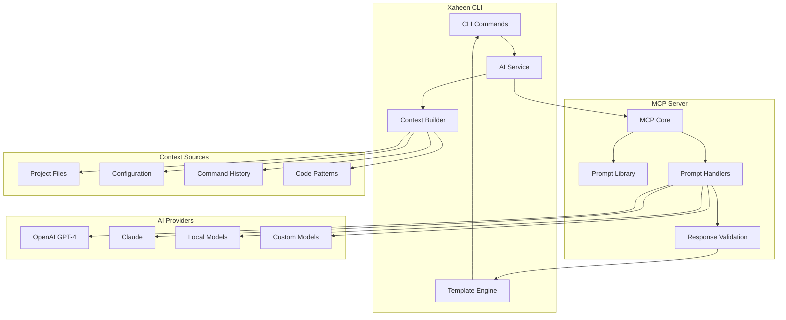

# AI Integration Overview

Xaheen CLI features deep AI integration powered by the Model Context Protocol (MCP) and multiple AI providers. This document provides a comprehensive overview of AI capabilities, architecture, and best practices.

## 🤖 AI Capabilities

### Core AI Features

1. **Natural Language Code Generation**
   - Generate complete components from descriptions
   - Create full-stack features with single prompts
   - Build complex architectures from specifications

2. **Intelligent Code Refactoring**
   - Modernize legacy code
   - Optimize performance
   - Apply design patterns
   - Fix anti-patterns

3. **Automated Error Resolution**
   - Fix TypeScript errors
   - Resolve linting issues
   - Address security vulnerabilities
   - Correct accessibility problems

4. **Norwegian Compliance Assistance**
   - Ensure NSM standards compliance
   - Implement GDPR requirements
   - Apply WCAG AAA accessibility
   - Integrate Norwegian services

5. **Context-Aware Suggestions**
   - Project-specific recommendations
   - Architecture improvements
   - Performance optimizations
   - Security enhancements

## 🏗️ AI Architecture

### System Overview



### MCP Integration

The Model Context Protocol (MCP) provides:

1. **Standardized Communication**
   - Consistent API across AI providers
   - Structured prompt formats
   - Validated responses

2. **Context Management**
   - Project analysis
   - Code understanding
   - Pattern recognition
   - Dependency awareness

3. **Prompt Engineering**
   - Pre-built prompt templates
   - Domain-specific prompts
   - Norwegian compliance prompts
   - Security-focused prompts

## 🚀 Using AI Features

### Basic AI Commands

```bash
# Generate code from natural language
xaheen ai code "create a user authentication system with email verification"

# Refactor existing code
xaheen ai refactor src/components/UserProfile.tsx

# Fix issues automatically
xaheen ai fix-types        # Fix TypeScript errors
xaheen ai fix-lint         # Fix linting issues
xaheen ai fix-security     # Fix security vulnerabilities
xaheen ai fix-a11y         # Fix accessibility issues

# Get AI assistance
xaheen ai explain src/utils/complexAlgorithm.ts
xaheen ai suggest improvements
xaheen ai review src/services/
```

### Advanced AI Usage

#### 1. Context-Aware Generation

```bash
# AI understands your project context
xaheen ai code "add a shopping cart feature that integrates with our existing product system"

# The AI will:
# - Analyze existing product models
# - Match your coding patterns
# - Use your design system
# - Follow your conventions
```

#### 2. Multi-Step Workflows

```bash
# Create complex features with AI assistance
xaheen ai workflow "implement multi-tenant SaaS architecture"

# This triggers:
# 1. Database schema design
# 2. Middleware implementation
# 3. API route isolation
# 4. Frontend context providers
# 5. Testing infrastructure
```

#### 3. Norwegian Compliance

```bash
# Ensure Norwegian standards
xaheen ai norwegian "implement BankID authentication"

# Generates:
# - BankID integration code
# - NSM-compliant security
# - GDPR consent management
# - Accessibility features
```

## 🧠 AI Providers

### Supported Providers

#### 1. OpenAI (Default)

```javascript
// xaheen.config.js
export default {
  ai: {
    provider: 'openai',
    model: 'gpt-4-turbo-preview',
    apiKey: process.env.OPENAI_API_KEY,
    options: {
      temperature: 0.7,
      maxTokens: 4000,
    }
  }
}
```

#### 2. Anthropic Claude

```javascript
// xaheen.config.js
export default {
  ai: {
    provider: 'anthropic',
    model: 'claude-3-opus',
    apiKey: process.env.ANTHROPIC_API_KEY,
    options: {
      maxTokens: 4000,
    }
  }
}
```

#### 3. Local Models

```javascript
// xaheen.config.js
export default {
  ai: {
    provider: 'local',
    model: 'codellama-13b',
    endpoint: 'http://localhost:11434',
    options: {
      temperature: 0.8,
    }
  }
}
```

#### 4. Custom Models

```javascript
// xaheen.config.js
export default {
  ai: {
    provider: 'custom',
    endpoint: 'https://your-ai-endpoint.com',
    headers: {
      'Authorization': `Bearer ${process.env.CUSTOM_AI_KEY}`
    },
    requestTransformer: (prompt) => ({
      messages: [{ role: 'user', content: prompt }]
    }),
    responseTransformer: (response) => response.choices[0].message.content
  }
}
```

## 📚 Prompt Library

### Built-in Prompts

Xaheen includes optimized prompts for common tasks:

```typescript
interface PromptLibrary {
  components: {
    'build-shadcn-page': 'Generate shadcn/ui pages'
    'create-dashboard': 'Build analytics dashboards'
    'responsive-layout': 'Create responsive layouts'
  }
  
  features: {
    'auth-system': 'Complete authentication'
    'payment-integration': 'Payment processing'
    'data-table': 'Advanced data tables'
  }
  
  norwegian: {
    'bankid-auth': 'BankID integration'
    'vipps-payment': 'Vipps payment flow'
    'altinn-integration': 'Altinn services'
  }
  
  optimization: {
    'performance': 'Performance optimization'
    'security': 'Security hardening'
    'accessibility': 'WCAG AAA compliance'
  }
}
```

### Custom Prompts

Create your own prompts:

```javascript
// .xaheen/prompts/my-prompt.js
export default {
  id: 'my-custom-prompt',
  name: 'Custom Feature Generator',
  description: 'Generate my specific feature pattern',
  
  template: `
    Generate a {featureType} with the following requirements:
    - TypeScript strict mode
    - Norwegian comments
    - Comprehensive testing
    - Performance optimized
    
    Context: {context}
    Requirements: {requirements}
  `,
  
  parameters: {
    featureType: {
      type: 'string',
      required: true,
      description: 'Type of feature to generate'
    },
    requirements: {
      type: 'array',
      required: false,
      description: 'Additional requirements'
    }
  },
  
  handler: async (params, context) => {
    // Custom processing logic
    return generatedCode;
  }
}
```

## 🔒 Security & Privacy

### Data Handling

1. **Local Context Only**
   - No code sent without explicit permission
   - Sensitive data automatically redacted
   - Environment variables never transmitted

2. **Secure Communication**
   - All API calls use HTTPS
   - API keys stored securely
   - Request/response encryption

3. **Compliance Mode**
   ```bash
   # Enable strict compliance mode
   xaheen ai --compliance-mode
   
   # This ensures:
   # - No external API calls
   # - Local processing only
   # - Audit trail generation
   # - Data residency compliance
   ```

### Privacy Controls

```javascript
// xaheen.config.js
export default {
  ai: {
    privacy: {
      sendContext: false,      // Don't send project context
      localOnly: true,         // Use local models only
      redactSecrets: true,     // Auto-redact secrets
      auditLog: true,          // Log all AI interactions
    }
  }
}
```

## 🎯 Best Practices

### 1. Provide Clear Context

```bash
# Good - specific and contextual
xaheen ai code "create a user profile component that displays name, email, avatar, and bio with edit functionality using our existing design system"

# Less effective - too vague
xaheen ai code "make user profile"
```

### 2. Iterative Refinement

```bash
# Start with basic generation
xaheen ai code "create a data table component"

# Refine with specific requirements
xaheen ai refactor src/components/DataTable.tsx --add "sorting, filtering, and pagination"

# Add compliance
xaheen ai norwegian-check src/components/DataTable.tsx
```

### 3. Review Generated Code

Always review AI-generated code for:
- Security vulnerabilities
- Performance implications
- Code style consistency
- Business logic accuracy

### 4. Use AI for Learning

```bash
# Understand complex code
xaheen ai explain src/utils/cryptography.ts

# Learn best practices
xaheen ai suggest "How can I improve the performance of this component?"

# Get architecture advice
xaheen ai review --architecture
```

## 🔧 Configuration

### AI Configuration Options

```javascript
// xaheen.config.js
export default {
  ai: {
    // Provider settings
    provider: 'openai',
    model: 'gpt-4',
    apiKey: process.env.OPENAI_API_KEY,
    
    // Generation settings
    temperature: 0.7,          // Creativity (0-1)
    maxTokens: 4000,          // Max response length
    timeout: 30000,           // Request timeout (ms)
    
    // Context settings
    contextWindow: 8000,      // Max context size
    includeFiles: true,       // Include file context
    includeHistory: true,     // Include command history
    
    // Safety settings
    validation: true,         // Validate responses
    sanitization: true,       // Sanitize outputs
    testing: true,           // Generate tests
    
    // Norwegian settings
    norwegianMode: true,      // Norwegian compliance
    language: 'en',          // Response language
    comments: 'no',          // Comment language
  }
}
```

### Environment Variables

```bash
# AI Provider Keys
OPENAI_API_KEY=sk-...
ANTHROPIC_API_KEY=sk-ant-...
CUSTOM_AI_ENDPOINT=https://...

# AI Behavior
XAHEEN_AI_ENABLED=true
XAHEEN_AI_PROVIDER=openai
XAHEEN_AI_MODEL=gpt-4
XAHEEN_AI_COMPLIANCE_MODE=false

# MCP Server
XAHEEN_MCP_ENDPOINT=http://localhost:3000
XAHEEN_MCP_API_KEY=your-mcp-key
```

## 📊 AI Performance

### Optimization Tips

1. **Cache AI Responses**
   ```bash
   # Enable AI caching
   xaheen config set ai.cache true
   
   # Clear AI cache
   xaheen cache clear --ai
   ```

2. **Batch Operations**
   ```bash
   # Generate multiple components at once
   xaheen ai batch generate components.yaml
   ```

3. **Use Local Models for Development**
   ```bash
   # Faster iteration with local models
   xaheen ai --local code "create component"
   ```

## 🚀 Advanced AI Features

### 1. AI-Driven Testing

```bash
# Generate comprehensive tests
xaheen ai test src/services/UserService.ts

# Generates:
# - Unit tests
# - Integration tests
# - Edge case tests
# - Performance tests
```

### 2. AI Code Reviews

```bash
# Get AI code review
xaheen ai review --pr main..feature/new-auth

# Reviews for:
# - Security issues
# - Performance problems
# - Code smells
# - Best practices
```

### 3. AI Documentation

```bash
# Generate documentation
xaheen ai document src/

# Creates:
# - API documentation
# - Component docs
# - Architecture diagrams
# - Usage examples
```

## 🔮 Future AI Capabilities

### Planned Features

1. **Autonomous Agents**
   - Self-improving code
   - Automated refactoring
   - Proactive optimization

2. **Visual AI**
   - Design-to-code
   - Screenshot-to-component
   - Figma integration

3. **Collaborative AI**
   - Team knowledge sharing
   - Code style learning
   - Pattern recognition

---

**Next Steps:**
- Configure [MCP Integration](./MCP.md)
- Explore [AI Commands](./COMMANDS.md)
- Learn [AI Security](./SECURITY.md)