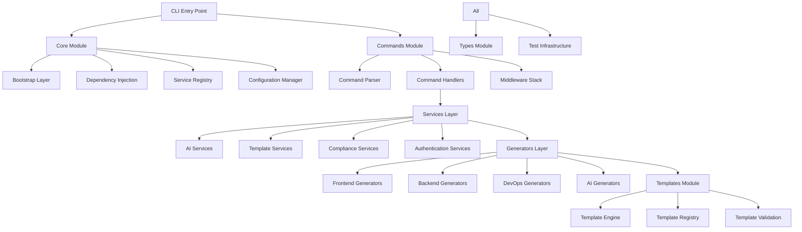
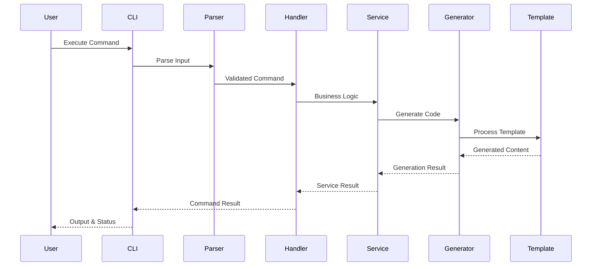
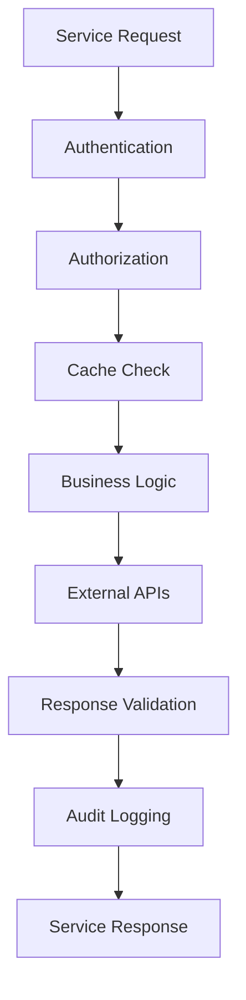
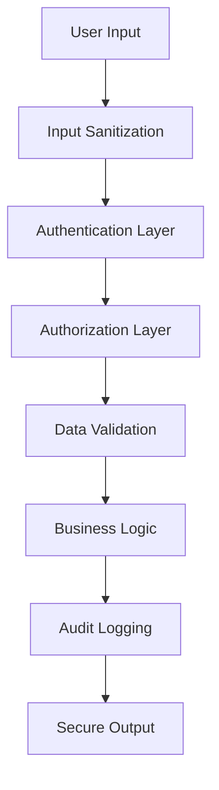
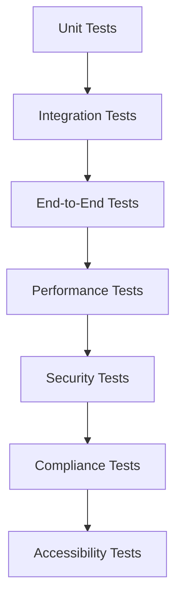
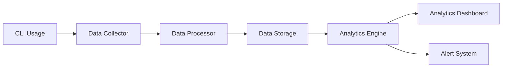

# Xaheen CLI Architecture Documentation

## Executive Summary

The Xaheen CLI is a sophisticated, enterprise-grade command-line interface built with a modular, extensible architecture. It implements advanced patterns including dependency injection, service-oriented architecture, and plugin extensibility while maintaining Norwegian compliance standards (NSM, GDPR) and WCAG AAA accessibility requirements.

## High-Level Architecture



## Core Architectural Principles

### 1. SOLID Principles

**Single Responsibility Principle (SRP)**
- Each module has a single, well-defined responsibility
- Services are focused on specific business domains
- Generators handle only their specific code generation tasks

**Open/Closed Principle (OCP)**
- System is open for extension through plugins and interfaces
- Closed for modification of core functionality
- New generators and services can be added without changing existing code

**Liskov Substitution Principle (LSP)**
- All service implementations can be substituted for their interfaces
- Template engines can be swapped without breaking functionality
- Generators follow consistent contracts

**Interface Segregation Principle (ISP)**
- Interfaces are specific to client needs
- Services depend only on interfaces they actually use
- No fat interfaces with unused methods

**Dependency Inversion Principle (DIP)**
- High-level modules don't depend on low-level modules
- Both depend on abstractions (interfaces)
- Dependencies are injected, not created

### 2. Domain-Driven Design (DDD)

The architecture follows DDD principles with clear bounded contexts:

- **CLI Domain**: Command parsing, execution, and user interaction
- **Generation Domain**: Code generation, templates, and output
- **Service Domain**: Business logic, external integrations, and utilities
- **Compliance Domain**: Norwegian regulations, security, and accessibility
- **AI Domain**: Artificial intelligence, machine learning, and automation

### 3. Service-Oriented Architecture (SOA)

Services are organized into cohesive, loosely-coupled modules:

```typescript
interface ServiceArchitecture {
  Core: {
    FileSystemService: FileSystemOperations;
    LoggerService: StructuredLogging;
    ConfigurationService: ConfigurationManagement;
  };
  
  Business: {
    AIService: ArtificialIntelligence;
    TemplateService: TemplateProcessing;
    ComplianceService: RegulatoryCompliance;
    AuthenticationService: UserAuthentication;
  };
  
  Infrastructure: {
    DatabaseService: DataPersistence;
    CacheService: PerformanceOptimization;
    NetworkService: ExternalCommunication;
  };
}
```

## Module Architecture

### 1. Commands Module

**Responsibility**: Command parsing, validation, and execution orchestration

```typescript
// Command Flow Architecture
CLI Input → Command Parser → Command Validator → Command Handler → Business Logic

interface CommandArchitecture {
  Parser: {
    tokenize(input: string[]): Token[];
    parse(tokens: Token[]): ParsedCommand;
    validate(command: ParsedCommand): ValidationResult;
  };
  
  Handler: {
    authenticate(context: CommandContext): Promise<AuthResult>;
    authorize(user: User, command: Command): Promise<boolean>;
    execute(command: Command): Promise<CommandResult>;
    audit(result: CommandResult): Promise<void>;
  };
}
```

**Key Components**:
- **Command Parser**: Advanced parsing with fuzzy matching and suggestion
- **Command Registry**: Dynamic command registration and discovery
- **Middleware Stack**: Authentication, authorization, logging, validation
- **Error Handling**: Comprehensive error handling with recovery strategies

### 2. Core Module

**Responsibility**: Foundational infrastructure and cross-cutting concerns

```typescript
// Core Infrastructure Architecture
interface CoreArchitecture {
  Bootstrap: {
    initialize(): Promise<void>;
    configureDependencies(): void;
    registerServices(): void;
    startPlugins(): Promise<void>;
  };
  
  DependencyInjection: {
    register<T>(token: string, implementation: T): void;
    resolve<T>(token: string): T;
    createScope(): Container;
  };
  
  Configuration: {
    load(sources: ConfigSource[]): Promise<void>;
    get<T>(key: string): T;
    validate(): ValidationResult;
  };
}
```

**Key Patterns**:
- **Dependency Injection Container**: IoC container with lifecycle management
- **Service Registry**: Centralized service discovery and health monitoring
- **Configuration Management**: Multi-source configuration with validation
- **Plugin Architecture**: Extensible plugin system with lifecycle hooks

### 3. Services Module

**Responsibility**: Business logic implementation and external integrations

```typescript
// Service Layer Architecture
interface ServiceLayerArchitecture {
  Domain: {
    UserManagement: UserService;
    ProjectManagement: ProjectService;
    CodeGeneration: GenerationService;
  };
  
  Infrastructure: {
    Authentication: AuthService;
    Storage: StorageService;
    Communication: NotificationService;
  };
  
  Integration: {
    AI: AIService;
    Cloud: CloudProviderService;
    ThirdParty: ExternalAPIService;
  };
}
```

**Service Categories**:
- **AI Services**: Machine learning, code analysis, suggestion generation
- **Template Services**: Template processing, validation, composition
- **Compliance Services**: Norwegian regulations, security, accessibility
- **Authentication Services**: Enterprise SSO, MFA, RBAC
- **Analytics Services**: Usage tracking, performance monitoring

### 4. Generators Module

**Responsibility**: Code generation orchestration and execution

```typescript
// Generator Architecture
interface GeneratorArchitecture {
  Registry: {
    register(type: string, generator: GeneratorClass): void;
    resolve(type: string): Generator;
    list(category?: string): GeneratorInfo[];
  };
  
  Execution: {
    plan(config: GeneratorConfig): ExecutionPlan;
    execute(plan: ExecutionPlan): Promise<GenerationResult>;
    validate(result: GenerationResult): ValidationResult;
  };
  
  Composition: {
    compose(generators: Generator[]): ComposedGenerator;
    orchestrate(workflow: GenerationWorkflow): Promise<WorkflowResult>;
  };
}
```

**Generator Categories**:
- **Frontend Generators**: React, Vue, Angular, Svelte components
- **Backend Generators**: Express, NestJS, FastAPI services
- **DevOps Generators**: Docker, Kubernetes, CI/CD pipelines
- **AI Generators**: AI-powered code generation and optimization
- **Compliance Generators**: Norwegian standard compliance

### 5. Templates Module

**Responsibility**: Template management, processing, and validation

```typescript
// Template System Architecture
interface TemplateSystemArchitecture {
  Engine: {
    compile(template: string): CompiledTemplate;
    render(template: CompiledTemplate, data: any): string;
    registerHelper(name: string, helper: Function): void;
  };
  
  Registry: {
    register(template: TemplateMetadata): void;
    find(criteria: SearchCriteria): Template[];
    load(path: string): Promise<Template>;
  };
  
  Validation: {
    validateSyntax(template: string): SyntaxValidation;
    validateSecurity(template: string): SecurityValidation;
    validateAccessibility(template: string): AccessibilityValidation;
  };
}
```

**Template Features**:
- **Multi-Platform Support**: Single templates for multiple frameworks
- **Norwegian Compliance**: Built-in compliance template features
- **AI Enhancement**: AI-powered template optimization
- **Composition System**: Complex template inheritance and composition

### 6. Types Module

**Responsibility**: Type safety and contract definition

```typescript
// Type System Architecture
interface TypeSystemArchitecture {
  Core: {
    CLITypes: CoreTypeDefinitions;
    CommandTypes: CommandTypeDefinitions;
    ServiceTypes: ServiceTypeDefinitions;
  };
  
  Domain: {
    GeneratorTypes: GeneratorTypeDefinitions;
    TemplateTypes: TemplateTypeDefinitions;
    ComplianceTypes: ComplianceTypeDefinitions;
  };
  
  Utility: {
    BrandTypes: TypeSafetyHelpers;
    ValidationTypes: RuntimeValidation;
    AsyncTypes: AsynchronousOperations;
  };
}
```

**Type Safety Features**:
- **Branded Types**: Domain-specific type safety
- **Discriminated Unions**: Type-safe state management
- **Type Guards**: Runtime type validation
- **Utility Types**: Advanced TypeScript type manipulation

## Data Flow Architecture

### 1. Command Execution Flow



### 2. Code Generation Flow

```mermaid
graph LR
    Config[Generator Config] --> Validator[Config Validator]
    Validator --> Registry[Generator Registry]
    Registry --> Generator[Selected Generator]
    Generator --> TemplateLoader[Template Loader]
    TemplateLoader --> TemplateEngine[Template Engine]
    TemplateEngine --> Validator2[Output Validator]
    Validator2 --> FileSystem[File System]
    FileSystem --> Result[Generation Result]
```



### 3. Service Interaction Flow



## Norwegian Compliance Architecture

### 1. NSM Security Standards

```typescript
interface NSMComplianceArchitecture {
  DataClassification: {
    classifier: DataClassifier;
    validator: ClassificationValidator;
    enforcer: SecurityEnforcer;
  };
  
  AuditTrail: {
    logger: AuditLogger;
    storage: SecureStorage;
    reporter: ComplianceReporter;
  };
  
  AccessControl: {
    authentication: MultiFactorAuth;
    authorization: RoleBasedAccess;
    monitoring: AccessMonitor;
  };
}
```

### 2. GDPR Compliance

```typescript
interface GDPRComplianceArchitecture {
  DataProcessing: {
    collector: DataCollectionService;
    processor: DataProcessingService;
    controller: DataControllerService;
  };
  
  UserRights: {
    access: DataAccessService;
    rectification: DataCorrectionService;
    erasure: DataErasureService;
    portability: DataPortabilityService;
  };
  
  Consent: {
    manager: ConsentManagementService;
    validator: ConsentValidator;
    recorder: ConsentRecorder;
  };
}
```

### 3. Accessibility Standards (WCAG AAA)

```typescript
interface AccessibilityArchitecture {
  Generation: {
    validator: AccessibilityValidator;
    enhancer: AccessibilityEnhancer;
    tester: AccessibilityTester;
  };
  
  Templates: {
    compliance: A11yTemplateCompliance;
    validation: A11yTemplateValidation;
    enhancement: A11yTemplateEnhancement;
  };
  
  Testing: {
    automated: AutomatedA11yTesting;
    manual: ManualA11yTesting;
    reporting: A11yReporting;
  };
}
```

## Performance Architecture

### 1. Caching Strategy

```typescript
interface CachingArchitecture {
  Memory: {
    templates: TemplateCache;
    configurations: ConfigCache;
    services: ServiceCache;
  };
  
  Disk: {
    generated: GeneratedCodeCache;
    dependencies: DependencyCache;
    metadata: MetadataCache;
  };
  
  Distributed: {
    redis: RedisCache;
    cdn: CDNCache;
    database: DatabaseCache;
  };
}
```

### 2. Parallel Processing

```typescript
interface ParallelProcessingArchitecture {
  Generation: {
    parallel: ParallelGenerationEngine;
    queue: GenerationQueue;
    worker: GenerationWorker;
  };
  
  Testing: {
    parallel: ParallelTestRunner;
    scheduling: TestScheduler;
    reporting: TestReporter;
  };
  
  Services: {
    async: AsyncServiceProcessor;
    batch: BatchProcessor;
    streaming: StreamProcessor;
  };
}
```

### 3. Resource Management

```typescript
interface ResourceManagementArchitecture {
  Memory: {
    monitor: MemoryMonitor;
    optimizer: MemoryOptimizer;
    profiler: MemoryProfiler;
  };
  
  CPU: {
    scheduler: CPUScheduler;
    balancer: LoadBalancer;
    profiler: CPUProfiler;
  };
  
  IO: {
    optimizer: IOOptimizer;
    cache: IOCache;
    monitor: IOMonitor;
  };
}
```

## Security Architecture

### 1. Security Layers



### 2. Threat Model

```typescript
interface ThreatModelArchitecture {
  InputThreats: {
    injection: SQLInjectionPrevention;
    xss: XSSPrevention;
    csrf: CSRFPrevention;
  };
  
  AuthenticationThreats: {
    bruteForce: BruteForceProtection;
    sessionHijacking: SessionProtection;
    tokenTheft: TokenSecurity;
  };
  
  DataThreats: {
    encryption: DataEncryption;
    integrity: DataIntegrity;
    confidentiality: DataConfidentiality;
  };
}
```

## Plugin Architecture

### 1. Plugin System

```typescript
interface PluginArchitecture {
  Lifecycle: {
    loader: PluginLoader;
    registry: PluginRegistry;
    manager: PluginManager;
  };
  
  API: {
    hooks: HookSystem;
    events: EventSystem;
    services: ServiceAPI;
  };
  
  Security: {
    sandbox: PluginSandbox;
    validator: PluginValidator;
    permissions: PluginPermissions;
  };
}
```

### 2. Extension Points

```typescript
interface ExtensionPoints {
  Commands: {
    register: CommandRegistration;
    middleware: MiddlewareRegistration;
    handlers: HandlerRegistration;
  };
  
  Generators: {
    register: GeneratorRegistration;
    templates: TemplateRegistration;
    validators: ValidatorRegistration;
  };
  
  Services: {
    register: ServiceRegistration;
    middleware: ServiceMiddleware;
    interceptors: ServiceInterceptors;
  };
}
```

## Testing Architecture

### 1. Testing Strategy



### 2. Test Infrastructure

```typescript
interface TestingArchitecture {
  Framework: {
    runner: TestRunner;
    parallel: ParallelExecution;
    reporting: TestReporting;
  };
  
  Mocking: {
    services: ServiceMocks;
    external: ExternalMocks;
    data: TestDataFactories;
  };
  
  Validation: {
    output: OutputValidation;
    performance: PerformanceValidation;
    security: SecurityValidation;
  };
}
```

## Deployment Architecture

### 1. Distribution Strategy

```typescript
interface DeploymentArchitecture {
  Packaging: {
    npm: NPMPackaging;
    binary: BinaryDistribution;
    container: ContainerPackaging;
  };
  
  Delivery: {
    cdn: CDNDelivery;
    registry: PackageRegistry;
    updates: AutoUpdater;
  };
  
  Installation: {
    global: GlobalInstallation;
    local: LocalInstallation;
    enterprise: EnterpriseDeployment;
  };
}
```

### 2. Environment Support

```typescript
interface EnvironmentSupport {
  OperatingSystems: {
    windows: WindowsSupport;
    macos: MacOSSupport;
    linux: LinuxSupport;
  };
  
  NodeVersions: {
    lts: LTSSupport;
    current: CurrentSupport;
    legacy: LegacySupport;
  };
  
  Environments: {
    development: DevEnvironment;
    staging: StagingEnvironment;
    production: ProductionEnvironment;
  };
}
```

## Monitoring and Observability

### 1. Telemetry Architecture

```typescript
interface TelemetryArchitecture {
  Metrics: {
    performance: PerformanceMetrics;
    usage: UsageMetrics;
    errors: ErrorMetrics;
  };
  
  Logging: {
    structured: StructuredLogging;
    distributed: DistributedTracing;
    correlation: CorrelationTracking;
  };
  
  Monitoring: {
    health: HealthMonitoring;
    alerts: AlertingSystem;
    dashboards: MonitoringDashboards;
  };
}
```

### 2. Analytics Pipeline



## Future Architecture Considerations

### 1. Microservices Evolution

The architecture is designed to evolve toward microservices:

- **Service Decomposition**: Individual services can be extracted
- **API Gateway**: CLI can become an API gateway
- **Event-Driven**: Services can communicate via events
- **Independent Deployment**: Services can be deployed independently

### 2. Cloud-Native Features

- **Containerization**: Full Docker/Kubernetes support
- **Service Mesh**: Istio/Linkerd integration
- **Serverless**: AWS Lambda/Azure Functions support
- **Multi-Cloud**: Provider-agnostic deployment

### 3. AI/ML Integration

- **Model Training**: Custom model training pipelines
- **AutoML**: Automated machine learning workflows
- **Edge Computing**: Local AI model execution
- **Federated Learning**: Distributed model training

## Best Practices and Guidelines

### 1. Development Guidelines

- **Code Quality**: Strict linting, formatting, and testing requirements
- **Security**: Security-first development approach
- **Performance**: Performance budgets and monitoring
- **Accessibility**: WCAG AAA compliance by default

### 2. Architecture Guidelines

- **Modularity**: Clear module boundaries and responsibilities
- **Extensibility**: Plugin-first architecture
- **Testability**: Test-driven development approach
- **Maintainability**: Clear documentation and code structure

### 3. Norwegian Compliance Guidelines

- **Data Protection**: Privacy by design approach
- **Security**: NSM security standards compliance
- **Accessibility**: Universal design principles
- **Transparency**: Clear data processing documentation

---

This architecture documentation provides a comprehensive overview of the Xaheen CLI's sophisticated, enterprise-grade design. The modular, extensible architecture ensures scalability, maintainability, and compliance with Norwegian enterprise standards while providing powerful code generation capabilities.