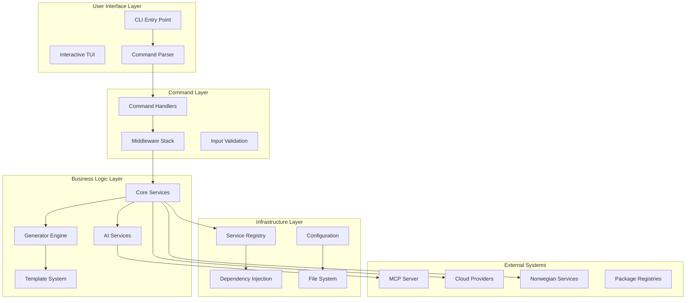
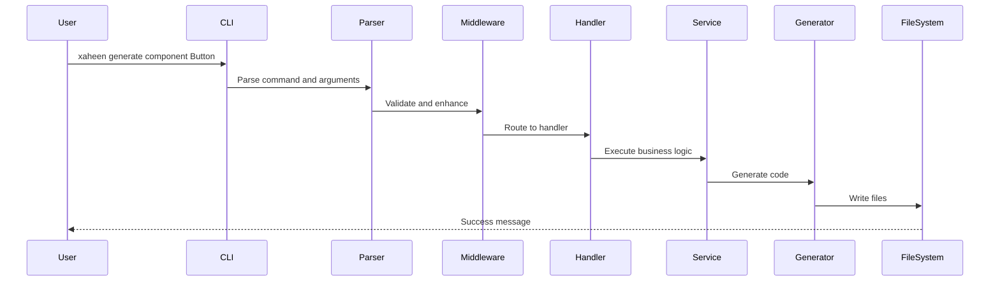
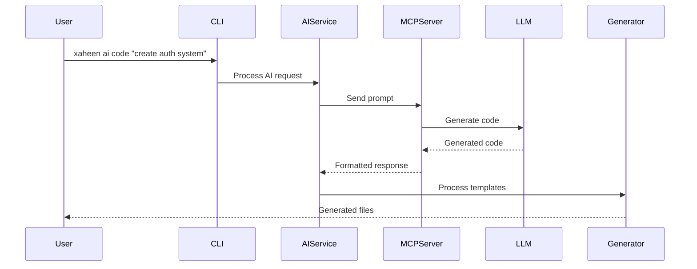

# Xaheen CLI Architecture Overview

This document provides a comprehensive overview of the Xaheen CLI's architecture, design principles, and system components. The CLI is built with enterprise-grade patterns focusing on modularity, extensibility, and Norwegian compliance standards.

## 🏗️ High-Level Architecture



## 🎯 Core Design Principles

### 1. SOLID Principles

The architecture strictly follows SOLID principles:

- **Single Responsibility**: Each module has one clear purpose
- **Open/Closed**: Extensible through plugins, closed for modification
- **Liskov Substitution**: All services implement consistent interfaces
- **Interface Segregation**: Minimal, focused interfaces
- **Dependency Inversion**: Depend on abstractions, not implementations

### 2. Domain-Driven Design (DDD)

The system is organized into bounded contexts:

```typescript
domains/
├── ai/           # AI and machine learning domain
├── app/          # Application scaffolding domain
├── component/    # Component generation domain
├── compliance/   # Norwegian compliance domain
├── project/      # Project management domain
├── service/      # Service integration domain
└── template/     # Template processing domain
```

### 3. Service-Oriented Architecture

Services are loosely coupled and independently deployable:

```typescript
interface ServiceArchitecture {
  core: {
    FileSystemService: "File operations and management"
    LoggerService: "Structured logging and monitoring"
    ConfigService: "Configuration management"
    CacheService: "Performance optimization"
  }
  
  business: {
    ProjectService: "Project lifecycle management"
    GeneratorService: "Code generation orchestration"
    AIService: "AI integration and processing"
    ComplianceService: "Norwegian standards compliance"
  }
  
  infrastructure: {
    RegistryService: "Service discovery and health"
    TelemetryService: "Monitoring and analytics"
    SecurityService: "Security and encryption"
    NetworkService: "External API communication"
  }
}
```

## 📦 Module Architecture

### Core Module

The foundation of the CLI system:

```typescript
core/
├── bootstrap/          # Application initialization
├── command-parser/     # Command parsing and routing
├── container/          # Dependency injection container
├── config-manager/     # Configuration management
├── registry/           # Service registry
└── modern-cli/         # Enhanced CLI features
```

**Key Responsibilities:**
- Application bootstrapping and initialization
- Dependency injection and service management
- Configuration loading and validation
- Command parsing with fuzzy matching
- Plugin system management

### Commands Module

Handles all user interactions:

```typescript
commands/
├── handlers/           # Command implementation
├── middleware/         # Command middleware
├── validation/         # Input validation
└── interactive/        # TUI components
```

**Command Categories:**
- **Make Commands**: Laravel-inspired generators
- **Project Commands**: Project creation and management
- **Service Commands**: Service integration
- **AI Commands**: AI-powered features
- **Utility Commands**: Validation, testing, deployment

### Services Module

Business logic implementation:

```typescript
services/
├── ai/                # AI and ML services
├── analysis/          # Code analysis
├── authentication/    # Auth providers
├── compliance/        # Norwegian compliance
├── deployment/        # Deployment services
├── generators/        # Generation services
├── templates/         # Template processing
└── validation/        # Validation services
```

### Generators Module

Code generation engine:

```typescript
generators/
├── frontend/          # React, Vue, Angular, Svelte
├── backend/           # Express, NestJS, Fastify
├── database/          # Prisma, TypeORM, Drizzle
├── devops/           # Docker, K8s, CI/CD
├── ai/               # AI-enhanced generation
├── compliance/       # Norwegian standards
└── meta/             # Generator generators
```

## 🔄 Data Flow Architecture

### Command Execution Flow



### AI Generation Flow



## 🔐 Security Architecture

### Security Layers

1. **Input Validation**
   - Command argument sanitization
   - Path traversal prevention
   - SQL injection protection

2. **Authentication**
   - API key management
   - OAuth integration
   - Enterprise SSO support

3. **Authorization**
   - Role-based access control
   - Feature flag enforcement
   - License validation

4. **Data Protection**
   - Encryption at rest
   - Secure credential storage
   - Audit logging

### Norwegian Compliance

```typescript
interface ComplianceArchitecture {
  NSM: {
    dataClassification: "Classify data sensitivity"
    auditTrail: "Complete audit logging"
    accessControl: "Role-based permissions"
  }
  
  GDPR: {
    dataMinimization: "Collect minimal data"
    userRights: "Right to access/delete"
    consent: "Explicit consent management"
  }
  
  Accessibility: {
    WCAG: "AAA compliance by default"
    universalDesign: "Inclusive design patterns"
    testing: "Automated accessibility tests"
  }
}
```

## 🔌 Plugin Architecture

### Plugin System

```typescript
interface PluginArchitecture {
  lifecycle: {
    discovery: "Find and load plugins"
    validation: "Validate plugin safety"
    registration: "Register capabilities"
    execution: "Sandbox execution"
  }
  
  capabilities: {
    commands: "Add new commands"
    generators: "Add generators"
    services: "Provide services"
    templates: "Custom templates"
  }
  
  api: {
    hooks: "Lifecycle hooks"
    events: "Event system"
    context: "Execution context"
    storage: "Plugin storage"
  }
}
```

### Extension Points

Plugins can extend:
- Command handlers
- Generator types
- Service providers
- Template engines
- Middleware stack
- Validation rules

## 🚀 Performance Architecture

### Optimization Strategies

1. **Lazy Loading**
   - Commands loaded on demand
   - Templates cached after first use
   - Services initialized when needed

2. **Parallel Processing**
   - Concurrent file operations
   - Parallel test execution
   - Batch API requests

3. **Caching**
   - Template compilation cache
   - Configuration cache
   - Dependency resolution cache

### Performance Metrics

```typescript
interface PerformanceTargets {
  startup: "< 100ms cold start"
  command: "< 50ms execution"
  generation: "< 500ms per file"
  ai: "< 5s for AI generation"
  build: "< 30s full build"
}
```

## 🧪 Testing Architecture

### Test Pyramid

```
         /\
        /  \  E2E Tests (10%)
       /----\
      /      \  Integration Tests (30%)
     /--------\
    /          \  Unit Tests (60%)
   /____________\
```

### Test Infrastructure

```typescript
testing/
├── unit/              # Isolated unit tests
├── integration/       # Service integration tests
├── e2e/              # End-to-end scenarios
├── performance/      # Performance benchmarks
├── security/         # Security testing
└── compliance/       # Norwegian compliance tests
```

## 📊 Monitoring & Observability

### Telemetry Architecture

```typescript
interface TelemetryArchitecture {
  metrics: {
    performance: "Command execution times"
    usage: "Feature usage statistics"
    errors: "Error rates and types"
  }
  
  logging: {
    structured: "JSON structured logs"
    contextual: "Request correlation"
    levels: "Debug, Info, Warn, Error"
  }
  
  tracing: {
    distributed: "Cross-service tracing"
    opentelemetry: "OpenTelemetry support"
    sampling: "Intelligent sampling"
  }
}
```

## 🔮 Future Architecture

### Planned Enhancements

1. **Microservices Evolution**
   - Service mesh integration
   - Independent deployment
   - Event-driven architecture

2. **Cloud-Native Features**
   - Kubernetes operators
   - Serverless functions
   - Multi-cloud support

3. **AI Advancements**
   - Local AI models
   - Custom model training
   - Federated learning

## 📚 Best Practices

### Development Guidelines

1. **Code Quality**
   - TypeScript strict mode
   - 90% test coverage
   - Security-first design

2. **Architecture Principles**
   - Clear boundaries
   - Minimal coupling
   - Maximum cohesion

3. **Performance Standards**
   - Sub-second responses
   - Minimal memory usage
   - Efficient algorithms

---

**Next Steps:**
- Explore [Module Architecture](./MODULES.md)
- Learn about [Service Architecture](./SERVICES.md)
- Understand [Plugin Architecture](./PLUGINS.md)