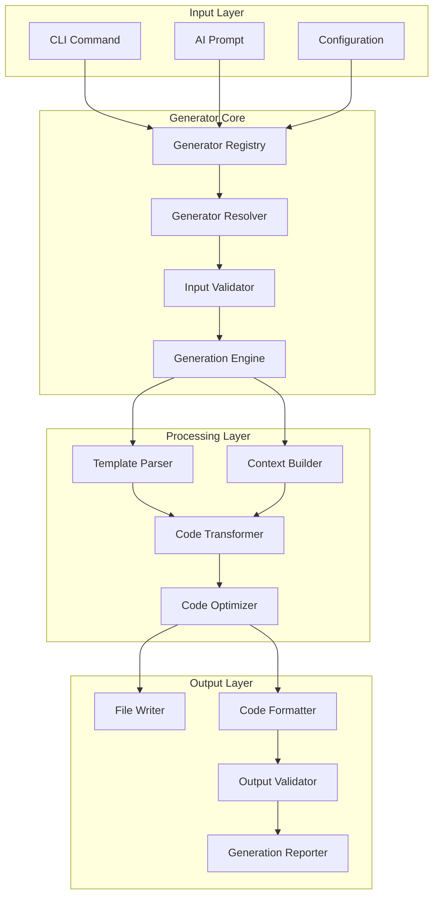

# Generator System Overview

The Xaheen CLI generator system is a powerful, extensible code generation framework that supports multiple platforms, frameworks, and paradigms. This document provides a comprehensive overview of how generators work, their architecture, and how to use them effectively.

## 🎯 Generator Philosophy

### Core Principles

1. **Convention over Configuration**
   - Smart defaults based on project context
   - Minimal configuration required
   - Consistent patterns across generators

2. **Platform Agnostic**
   - Single generator supports multiple frameworks
   - Adaptive output based on target platform
   - Unified API across all generators

3. **AI-Enhanced**
   - Natural language understanding
   - Context-aware generation
   - Intelligent suggestions

4. **Norwegian Compliance**
   - Built-in compliance features
   - Accessibility by default
   - Security-first approach

## 🏗️ Generator Architecture

### System Overview



### Generator Categories

```typescript
interface GeneratorCategories {
  frontend: {
    component: "UI components"
    page: "Application pages"
    layout: "Layout structures"
    hook: "React hooks"
    context: "Context providers"
  }
  
  backend: {
    api: "API endpoints"
    service: "Business services"
    model: "Data models"
    middleware: "HTTP middleware"
    job: "Background jobs"
  }
  
  fullstack: {
    feature: "Complete features"
    crud: "CRUD operations"
    auth: "Authentication systems"
    integration: "Service integrations"
  }
  
  infrastructure: {
    docker: "Docker configuration"
    kubernetes: "K8s manifests"
    terraform: "Infrastructure as Code"
    cicd: "CI/CD pipelines"
  }
}
```

## 🚀 Using Generators

### Basic Usage

```bash
# Component generation
xaheen generate component Button
xaheen generate component UserCard --props "name:string email:string"

# Page generation
xaheen generate page Dashboard --layout admin
xaheen generate page ProductList --template e-commerce

# API generation
xaheen generate api users --methods get,post,put,delete
xaheen generate api auth --type graphql

# Model generation
xaheen generate model User --fields "name:string email:string:unique"
xaheen generate model Product --with-repository --with-validation
```

### Advanced Usage

#### 1. Multi-File Generation

```bash
# Generate complete feature
xaheen generate feature user-management

# This creates:
# - models/User.ts
# - services/UserService.ts
# - controllers/UserController.ts
# - components/UserList.tsx
# - components/UserForm.tsx
# - pages/users/index.tsx
# - pages/users/[id].tsx
# - tests/user.test.ts
```

#### 2. AI-Enhanced Generation

```bash
# Natural language generation
xaheen ai generate "create a blog system with categories, tags, and comments"

# AI understands and creates:
# - Database models with relationships
# - API endpoints with proper RESTful design
# - Frontend components with state management
# - Admin interface for content management
```

#### 3. Platform-Specific Generation

```bash
# React component
xaheen generate component Button --platform react

# Vue component
xaheen generate component Button --platform vue

# Angular component
xaheen generate component Button --platform angular

# The generator adapts output to each platform's conventions
```

## 🧩 Generator Types

### Frontend Generators

#### Component Generator

```bash
xaheen generate component [name] [options]

Options:
  --props <props>        Component properties
  --platform <platform>  Target platform (react/vue/angular/svelte)
  --typescript          Use TypeScript (default: true)
  --stories             Generate Storybook stories
  --tests               Generate tests
  --style <type>        Styling approach (css/scss/styled/tailwind)
```

Example:
```bash
xaheen generate component Card \
  --props "title:string content:string image?:string" \
  --stories \
  --tests
```

#### Page Generator

```bash
xaheen generate page [name] [options]

Options:
  --layout <layout>      Page layout template
  --route <route>        Custom route path
  --auth                Require authentication
  --ssr                 Server-side rendering
  --static              Static generation
```

Example:
```bash
xaheen generate page user-profile \
  --layout authenticated \
  --route "/users/:id" \
  --auth
```

### Backend Generators

#### API Generator

```bash
xaheen generate api [resource] [options]

Options:
  --methods <methods>    HTTP methods (get,post,put,delete)
  --type <type>         API type (rest/graphql/grpc)
  --auth <type>         Authentication type
  --validation          Add input validation
  --documentation       Generate API docs
```

Example:
```bash
xaheen generate api products \
  --methods get,post,put,delete \
  --auth jwt \
  --validation \
  --documentation
```

#### Service Generator

```bash
xaheen generate service [name] [options]

Options:
  --type <type>         Service type (business/data/integration)
  --inject <services>   Services to inject
  --cache              Add caching layer
  --queue              Add queue support
```

Example:
```bash
xaheen generate service EmailService \
  --type integration \
  --inject "TemplateService,QueueService" \
  --queue
```

### Database Generators

#### Model Generator

```bash
xaheen generate model [name] [options]

Options:
  --fields <fields>     Model fields definition
  --relations <rels>    Model relationships
  --timestamps          Add created/updated timestamps
  --soft-delete         Add soft delete support
  --validation          Add validation schema
```

Example:
```bash
xaheen generate model Article \
  --fields "title:string content:text author:relation:User" \
  --timestamps \
  --soft-delete
```

#### Migration Generator

```bash
xaheen generate migration [name] [options]

Options:
  --create <table>      Create new table
  --alter <table>       Alter existing table
  --drop <table>        Drop table
  --index <fields>      Add indexes
```

Example:
```bash
xaheen generate migration add-user-roles \
  --create roles \
  --alter users \
  --index "email,created_at"
```

## 🎨 Template System

### Template Structure

```handlebars
{{!-- Component Template Example --}}
import React from 'react';
{{#if typescript}}
import type { FC } from 'react';
{{/if}}
{{#if styling.tailwind}}
import { cn } from '@/lib/utils';
{{/if}}

{{#if typescript}}
interface {{pascalCase name}}Props {
  {{#each props}}
  {{name}}{{#if optional}}?{{/if}}: {{type}};
  {{/each}}
}
{{/if}}

export const {{pascalCase name}}{{#if typescript}}: FC<{{pascalCase name}}Props>{{/if}} = ({
  {{#each props}}
  {{name}},
  {{/each}}
}) => {
  return (
    <div{{#if styling.tailwind}} className={cn('{{defaultClasses}}')}{{/if}}>
      {{!-- Component content --}}
    </div>
  );
};
```

### Template Variables

Available in all templates:

```typescript
interface TemplateContext {
  // Names
  name: string;              // Original name
  pascalCase: string;        // PascalCase version
  camelCase: string;         // camelCase version
  kebabCase: string;         // kebab-case version
  snakeCase: string;         // snake_case version
  
  // Project context
  project: {
    name: string;
    framework: string;
    language: string;
    features: string[];
  };
  
  // Generator options
  options: Record<string, any>;
  
  // Compliance
  compliance: {
    classification: string;
    gdpr: boolean;
    accessibility: string;
  };
}
```

## 🔧 Custom Generators

### Creating a Custom Generator

```typescript
// generators/custom/my-generator.ts
import { BaseGenerator } from '@xaheen-ai/cli';

export class MyGenerator extends BaseGenerator {
  static meta = {
    name: 'my-generator',
    description: 'Custom generator for specific needs',
    category: 'custom',
    platforms: ['react', 'vue'],
  };
  
  async validate(options: GeneratorOptions): Promise<ValidationResult> {
    // Validate input options
    return { valid: true };
  }
  
  async prepare(options: GeneratorOptions): Promise<GeneratorContext> {
    // Build generation context
    return {
      ...options,
      templateData: {
        // Custom template data
      }
    };
  }
  
  async generate(context: GeneratorContext): Promise<GeneratorResult> {
    // Generate files
    const files = await this.processTemplates(context);
    
    return {
      files,
      messages: ['Generated successfully'],
    };
  }
  
  async postGenerate(result: GeneratorResult): Promise<void> {
    // Post-generation tasks
    await this.formatFiles(result.files);
    await this.runTests(result.files);
  }
}
```

### Registering Custom Generator

```javascript
// xaheen.config.js
export default {
  generators: {
    custom: [
      './generators/custom/my-generator.ts'
    ]
  }
}
```

## 🤖 AI-Powered Generation

### How AI Generation Works

1. **Context Analysis**
   - Analyzes project structure
   - Understands existing patterns
   - Identifies dependencies

2. **Prompt Processing**
   - Natural language understanding
   - Intent extraction
   - Requirement parsing

3. **Code Generation**
   - Template selection
   - Variable population
   - Pattern application

4. **Optimization**
   - Code formatting
   - Import optimization
   - Performance hints

### AI Generator Examples

```bash
# Complex component generation
xaheen ai generate "create a data table with sorting, filtering, pagination, and CSV export"

# Full feature generation
xaheen ai generate "implement user roles and permissions system with admin interface"

# Integration generation
xaheen ai generate "add Stripe payment processing with subscription management"
```

## 📊 Generator Configuration

### Project-Level Configuration

```javascript
// xaheen.config.js
export default {
  generators: {
    // Default options for all generators
    defaults: {
      typescript: true,
      tests: true,
      documentation: true,
    },
    
    // Component-specific defaults
    component: {
      platform: 'react',
      styling: 'tailwind',
      stories: true,
    },
    
    // API-specific defaults
    api: {
      type: 'rest',
      authentication: 'jwt',
      validation: true,
    },
    
    // Custom templates directory
    templatesDir: './generators/templates',
    
    // Custom generators
    custom: [
      './generators/custom'
    ]
  }
}
```

### Generator Presets

```javascript
// .xaheen/presets/enterprise.js
export default {
  name: 'enterprise',
  generators: {
    component: {
      typescript: true,
      tests: true,
      stories: true,
      accessibility: 'AAA',
      documentation: true,
    },
    api: {
      authentication: 'oauth2',
      validation: true,
      documentation: true,
      monitoring: true,
      rateLimit: true,
    }
  }
}
```

## 🧪 Testing Generated Code

### Automatic Testing

Generators can include automatic testing:

```bash
# Generate with tests
xaheen generate component Button --tests

# Run tests after generation
xaheen generate api users --test-after
```

### Test Templates

```typescript
// Test template for components
describe('{{pascalCase name}}', () => {
  it('renders without crashing', () => {
    render(<{{pascalCase name}} />);
  });
  
  {{#each props}}
  it('handles {{name}} prop correctly', () => {
    const { getByText } = render(
      <{{pascalCase ../name}} {{name}}="test value" />
    );
    expect(getByText('test value')).toBeInTheDocument();
  });
  {{/each}}
  
  it('meets accessibility standards', async () => {
    const { container } = render(<{{pascalCase name}} />);
    const results = await axe(container);
    expect(results).toHaveNoViolations();
  });
});
```

## 🚀 Best Practices

### 1. Use Appropriate Generators

```bash
# For UI components
xaheen generate component Button

# For business logic
xaheen generate service PaymentService

# For data models
xaheen generate model Order
```

### 2. Leverage AI for Complex Generation

```bash
# Let AI handle complex requirements
xaheen ai generate "create a real-time chat system with typing indicators and read receipts"

# Instead of multiple manual generations
```

### 3. Maintain Consistency

```bash
# Use project configuration for consistency
xaheen config set generators.component.styling tailwind

# All future components will use Tailwind
```

### 4. Validate Generated Code

```bash
# Always validate after generation
xaheen generate model User --fields "email:string"
xaheen validate

# Fix any issues
xaheen ai fix-types
```

## 📚 Generator Recipes

### Common Patterns

#### Authentication System

```bash
# Complete auth system
xaheen generate feature authentication \
  --providers "email,google,github" \
  --features "mfa,password-reset,email-verification"
```

#### Admin Dashboard

```bash
# Admin interface
xaheen generate feature admin-dashboard \
  --sections "users,content,analytics,settings" \
  --theme dark
```

#### E-commerce Components

```bash
# Product catalog
xaheen generate feature product-catalog \
  --features "search,filters,sorting,pagination"

# Shopping cart
xaheen generate feature shopping-cart \
  --storage "local,session,database"
```

---

**Next Steps:**
- Explore [Frontend Generators](./FRONTEND.md)
- Learn [Backend Generators](./BACKEND.md)
- Create [Custom Generators](./CUSTOM.md)