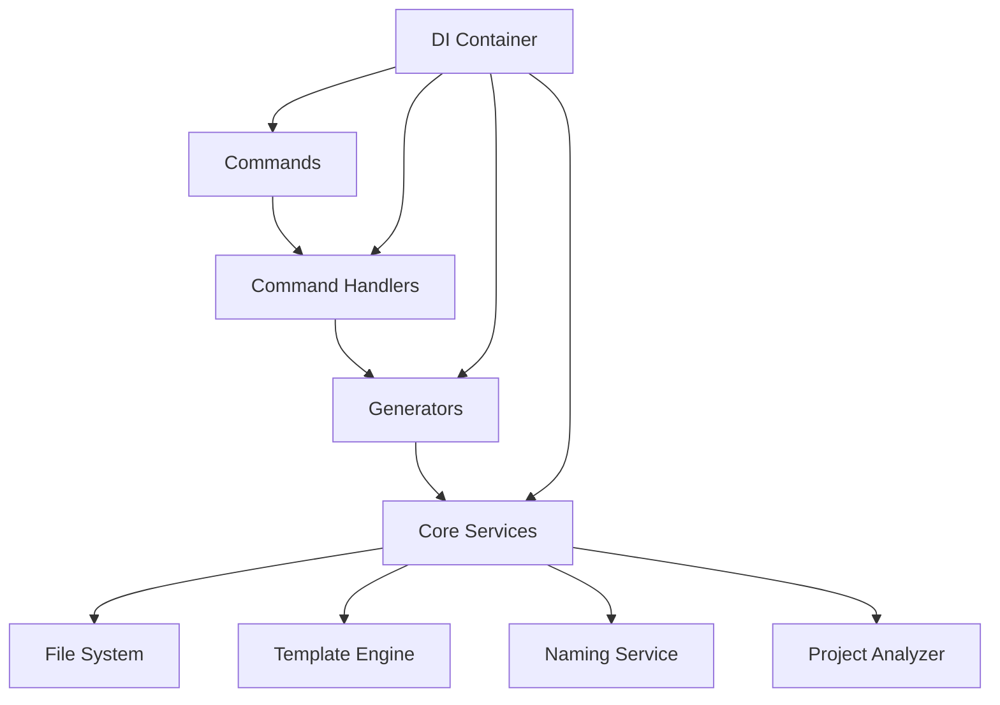

# 🏗️ Xaheen CLI SOLID Refactoring Migration Guide

## 📋 Overview

This guide provides a comprehensive migration strategy to refactor the Xaheen CLI from its current monolithic structure to a modular, SOLID-principles-based architecture.

## 🎯 Refactoring Goals

- **Single Responsibility**: Each class/module has one reason to change
- **Open/Closed**: Open for extension, closed for modification
- **Liskov Substitution**: Subtypes must be substitutable for their base types
- **Interface Segregation**: Clients depend only on methods they use
- **Dependency Inversion**: Depend on abstractions, not concretions

## 📊 Current Issues Identified

### 🚨 Critical Files to Refactor

| File | Lines | Issues | Priority |
|------|-------|--------|----------|
| `gcp.generator.ts` | 6,648 | Massive monolith, multiple responsibilities | Critical |
| `terraform.generator.ts` | 3,775 | Infrastructure + templating + validation | High |
| `sse.generator.ts` | 3,560 | Real-time logic + WebSocket + HTTP handling | High |
| `refactoring.generator.ts` | 3,448 | AST manipulation + file operations + AI integration | High |
| `generate.ts` (command) | 867 | Command parsing + validation + execution | Medium |

### 🔍 SOLID Principle Violations

1. **SRP Violations**:
   - BaseGenerator handles file ops, templating, naming, project detection
   - Large generators contain infrastructure, business logic, templates
   - Commands mix parsing, validation, execution

2. **OCP Violations**:
   - Adding new generators requires modifying existing code
   - Hard-coded generator types in command handlers

3. **DIP Violations**:
   - Direct instantiation of concrete classes
   - No dependency injection
   - Tight coupling between layers

## 🏗️ New Architecture

### 📁 Directory Structure

```
src/
├── core/
│   ├── interfaces/           # All abstractions
│   ├── container/           # Dependency injection
│   ├── services/           # Core service implementations
│   ├── generators/         # Base generator classes
│   └── bootstrap/          # Application initialization
├── generators/
│   ├── component/          # Component generation logic
│   ├── service/           # Service generation logic
│   ├── infrastructure/    # Infrastructure generators
│   └── cloud/            # Cloud-specific generators
├── commands/
│   └── handlers/          # Command handlers
└── services/
    ├── templates/         # Template management
    ├── validation/        # Validation services
    └── ai/               # AI integration services
```

### 🔗 Dependency Graph



## 📝 Migration Steps

### Phase 1: Interface Segregation (Completed ✅)

- [x] Create core interfaces for all services
- [x] Define service contracts
- [x] Establish dependency injection tokens

### Phase 2: Dependency Injection (Completed ✅)

- [x] Implement DI container
- [x] Create service configurator
- [x] Add application bootstrap

### Phase 3: Core Services (Completed ✅)

- [x] Refactor logger service
- [x] Refactor file system service
- [x] Refactor naming service
- [x] Refactor project analyzer
- [x] Refactor template engine

### Phase 4: Generators Refactoring

#### 4.1 Refactor BaseGenerator ✅

- [x] Split concerns into separate services
- [x] Use dependency injection
- [x] Apply Template Method Pattern

#### 4.2 Component Generator ✅

- [x] Implement strategy pattern for frameworks
- [x] Separate template generation logic
- [x] Add proper validation

#### 4.3 Large Generator Refactoring (TODO)

**GCP Generator Breakdown:**
```typescript
// Current: 6,648 lines in one file
// Target: Multiple focused modules

src/generators/cloud/gcp/
├── gcp-generator.ts           # Main orchestrator (200 lines)
├── services/
│   ├── compute-service.ts     # Cloud Functions, Cloud Run
│   ├── storage-service.ts     # Cloud Storage, Firestore
│   ├── auth-service.ts        # Firebase Auth
│   ├── messaging-service.ts   # Pub/Sub
│   └── monitoring-service.ts  # Monitoring, Logging
├── templates/
│   ├── terraform/            # Infrastructure as Code
│   ├── functions/            # Cloud Functions templates
│   └── configs/              # Configuration templates
└── validators/
    ├── resource-validator.ts
    └── quota-validator.ts
```

### Phase 5: Command Handler Refactoring (Completed ✅)

- [x] Separate command parsing from execution
- [x] Use dependency injection for generators
- [x] Implement command registry pattern

### Phase 6: Service Layer Refactoring

#### 6.1 Template Services
```typescript
// Before: Templates scattered across generators
// After: Centralized template management

src/services/templates/
├── template-manager.ts        # Central template coordination
├── template-resolver.ts       # Template path resolution
├── template-cache.ts         # Template caching
└── framework-adapters/       # Framework-specific templates
    ├── react-adapter.ts
    ├── vue-adapter.ts
    └── angular-adapter.ts
```

#### 6.2 AI Services
```typescript
// Before: AI logic mixed with generators
// After: Dedicated AI services

src/services/ai/
├── ai-orchestrator.ts        # Main AI coordination
├── code-analyzer.ts          # Code analysis
├── suggestion-engine.ts      # Intelligent suggestions
└── enhancement-service.ts    # Code enhancement
```

## 🔄 Migration Process

### Step 1: Prepare New Structure

1. Create new directory structure
2. Copy existing files to new locations
3. Update import paths

### Step 2: Gradual Migration

1. **Start with Core Services** (✅ Completed)
   - Migrate logger, file system, naming services
   - Ensure all tests pass

2. **Migrate Generators One by One**
   - Start with smallest generators
   - Use new base generator pattern
   - Maintain backward compatibility

3. **Update Command Handlers** (✅ Completed)
   - Use new dependency injection
   - Update generator instantiation

4. **Refactor Large Files**
   - Break down monolithic generators
   - Extract services and strategies
   - Maintain same public API

### Step 3: Update Tests

```typescript
// Before: Tight coupling makes testing difficult
const generator = new ComponentGenerator();

// After: Easy to mock dependencies
const mockLogger = new MockLogger();
const mockFileSystem = new MockFileSystem();
const generator = new ComponentGenerator(mockLogger, mockFileSystem, ...);
```

### Step 4: Performance Optimization

1. **Template Caching**: Cache compiled templates
2. **Lazy Loading**: Load generators on demand
3. **Service Singletons**: Share expensive services

## 🔧 Implementation Examples

### Before: Monolithic Generator
```typescript
// Old approach - 3,000+ lines in one file
export class GCPGenerator extends BaseGenerator {
  async generate(options) {
    // 200 lines of validation
    // 500 lines of Cloud Functions logic
    // 400 lines of Firestore logic  
    // 300 lines of Cloud Storage logic
    // 1,000+ lines of Terraform generation
    // 600+ lines of configuration
  }
}
```

### After: Modular Architecture
```typescript
// New approach - focused responsibilities
export class GCPGenerator extends BaseGenerator {
  constructor(
    logger: ILogger,
    fileSystem: IFileSystem,
    private readonly computeService: IGCPComputeService,
    private readonly storageService: IGCPStorageService,
    private readonly authService: IGCPAuthService
  ) {
    super(logger, fileSystem);
  }

  async generate(options: GCPOptions): Promise<GeneratorResult> {
    await this.validate(options);
    
    const results: string[] = [];
    
    if (options.cloudFunctions.enabled) {
      const files = await this.computeService.generateCloudFunctions(options.cloudFunctions);
      results.push(...files);
    }
    
    if (options.firestore.enabled) {
      const files = await this.storageService.generateFirestore(options.firestore);
      results.push(...files);
    }
    
    return { success: true, files: results };
  }
}
```

### Service Implementation
```typescript
// Focused service - single responsibility
export class GCPComputeService implements IGCPComputeService {
  constructor(
    private readonly templateEngine: ITemplateEngine,
    private readonly validator: IGCPResourceValidator
  ) {}

  async generateCloudFunctions(config: CloudFunctionsConfig): Promise<string[]> {
    await this.validator.validateCloudFunctions(config);
    
    const files: string[] = [];
    
    // Generate function code
    for (const trigger of config.triggers) {
      const functionFile = await this.generateFunction(trigger);
      files.push(functionFile);
    }
    
    // Generate deployment configuration
    const deploymentFile = await this.generateDeployment(config);
    files.push(deploymentFile);
    
    return files;
  }
}
```

## 🧪 Testing Strategy

### Unit Testing
```typescript
describe('ComponentGenerator', () => {
  let generator: ComponentGenerator;
  let mockLogger: MockLogger;
  let mockFileSystem: MockFileSystem;
  
  beforeEach(() => {
    mockLogger = new MockLogger();
    mockFileSystem = new MockFileSystem();
    generator = new ComponentGenerator(mockLogger, mockFileSystem, ...);
  });
  
  it('should generate React component', async () => {
    const result = await generator.generate({
      name: 'TestComponent',
      framework: 'react'
    });
    
    expect(result.success).toBe(true);
    expect(mockFileSystem.getFiles()).toContain('src/components/TestComponent.tsx');
  });
});
```

### Integration Testing
```typescript
describe('Generate Command Integration', () => {
  let app: ApplicationBootstrap;
  let handler: GenerateCommandHandler;
  
  beforeEach(() => {
    app = new ApplicationBootstrap();
    app.initialize();
    handler = app.getService(GENERATE_HANDLER_TOKEN);
  });
  
  it('should generate complete component with tests and stories', async () => {
    const result = await handler.handle({
      type: 'component',
      name: 'UserCard',
      tests: true,
      stories: true
    });
    
    expect(result.success).toBe(true);
  });
});
```

## 📈 Benefits After Migration

### 🎯 Maintainability
- **Smaller Files**: Largest file ~200 lines instead of 6,600+
- **Clear Boundaries**: Each service has single responsibility
- **Easy Testing**: Mockable dependencies

### 🔧 Extensibility  
- **New Generators**: Add without modifying existing code
- **New Frameworks**: Plugin architecture supports extensions
- **New Features**: Compose existing services

### 🚀 Performance
- **Lazy Loading**: Load generators on demand
- **Template Caching**: Compile templates once
- **Service Reuse**: Share expensive operations

### 👥 Developer Experience
- **Clear APIs**: Well-defined interfaces
- **Type Safety**: Full TypeScript support
- **Documentation**: Self-documenting code

## ⚡ Quick Start with New Architecture

```typescript
// Initialize application
import { app } from './core/bootstrap/service-configurator';

// Get services
const container = app.initialize();
const logger = container.resolve<ILogger>(SERVICE_TOKENS.LOGGER);
const componentGenerator = container.resolve<ComponentGenerator>(COMPONENT_GENERATOR_TOKEN);

// Generate component
const result = await componentGenerator.generate({
  name: 'UserProfile',
  framework: 'react',
  tests: true,
  stories: true
});

logger.success('Component generated successfully!');
```

## 🔄 Rollback Strategy

1. **Maintain Old API**: Keep existing public interfaces
2. **Feature Flags**: Toggle between old/new implementations
3. **Gradual Migration**: Migrate generators one at a time
4. **Comprehensive Tests**: Ensure no regression

## 📋 Migration Checklist

### Phase 1: Foundation ✅
- [x] Core interfaces defined
- [x] Dependency injection container
- [x] Service configurator
- [x] Application bootstrap

### Phase 2: Core Services ✅
- [x] Logger service refactored
- [x] File system service refactored  
- [x] Naming service refactored
- [x] Project analyzer refactored
- [x] Template engine refactored

### Phase 3: Generators (In Progress)
- [x] Base generator refactored
- [x] Component generator refactored
- [ ] Service generator refactored
- [ ] GCP generator broken down
- [ ] Terraform generator broken down

### Phase 4: Commands ✅
- [x] Generate command handler refactored
- [x] Command registry implemented
- [x] Dependency injection integrated

### Phase 5: Large File Breakdown (TODO)
- [ ] Break down GCP generator (6,648 lines → ~10 modules)
- [ ] Break down Terraform generator (3,775 lines → ~8 modules)  
- [ ] Break down SSE generator (3,560 lines → ~6 modules)
- [ ] Break down AI refactoring generator (3,448 lines → ~7 modules)

### Phase 6: Testing & Documentation (TODO)
- [ ] Update all unit tests
- [ ] Add integration tests
- [ ] Update documentation
- [ ] Performance benchmarks

## 🎉 Expected Outcomes

After completing this migration:

1. **Reduced Complexity**: Largest files <300 lines
2. **Improved Testability**: 100% mockable dependencies
3. **Enhanced Maintainability**: Clear separation of concerns
4. **Better Performance**: Optimized service lifecycle
5. **Developer Productivity**: Faster development cycles

The migration will transform the Xaheen CLI from a monolithic structure to a modern, maintainable, and extensible architecture following SOLID principles.