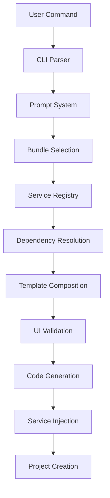

# CLI Architecture Overview

## System Architecture

The Xaheen CLI follows a modular, service-based architecture designed for extensibility and maintainability.

```
xaheen-cli/
├── src/
│   ├── services/
│   │   ├── registry/          # Service registry system
│   │   ├── templates/         # Template fragment system
│   │   ├── ui-compliance/     # UI validation engine
│   │   └── engine/           # Service injection engine
│   ├── commands/             # CLI commands
│   ├── prompts/              # Interactive prompts
│   └── utils/                # Utilities
├── services/                 # Service definitions (JSON)
│   ├── definitions/          # Individual service configs
│   ├── bundles/             # Service bundle definitions
│   └── metadata/            # Service metadata
└── templates/               # Template files
    ├── saas/                # SaaS-specific templates
    ├── landing/             # Landing page templates
    └── shared/              # Shared components
```

## Core Components

### 1. Service Registry

The service registry is the heart of the CLI, managing all service definitions and their relationships.

```typescript
class EnhancedServiceRegistry extends EventEmitter {
  private templates: Map<string, ServiceTemplate>;
  private metadata: ServiceMetadataManager;
  private validator: ServiceValidator;
  
  async initialize(): Promise<void>;
  async getTemplate(category: string, id: string): Promise<ServiceTemplate>;
  async registerTemplate(template: ServiceTemplate): Promise<void>;
}
```

**Key Features:**
- Dynamic service loading
- Metadata tracking
- Event-driven updates
- Validation system
- Caching layer

### 2. Bundle System

Bundles are pre-configured collections of services designed for specific use cases.

```typescript
interface ServiceBundle {
  id: string;
  name: string;
  type: 'saas-starter' | 'saas-professional' | 'saas-enterprise';
  services: BundleService[];
  compliance?: ComplianceRequirement[];
  deployment?: DeploymentConfig;
}
```

**Available Bundles:**
- **SaaS Starter**: Essential services for MVP
- **SaaS Professional**: Scaling features
- **SaaS Enterprise**: Advanced compliance
- **FinTech SaaS**: Financial regulations
- **Healthcare SaaS**: HIPAA compliance
- **Marketplace SaaS**: Multi-vendor support

### 3. Template Fragment System

The fragment system enables composable, reusable template generation.

```typescript
class FragmentRegistry {
  private fragments: Map<string, Fragment>;
  
  async getFragment(category: string, name: string): Promise<Fragment>;
  async composeFragments(fragments: string[], context: any): Promise<string>;
  validateFragment(fragment: Fragment): ValidationResult;
}
```

**Fragment Categories:**
- Auth providers
- Payment integrations
- UI components
- API endpoints
- Database schemas
- Deployment configs

### 4. UI Compliance Engine

Ensures all generated code follows Xala UI System v5 rules.

```typescript
class XalaValidator {
  validateComponent(code: string, filename: string): ValidationResult;
  validateDesignTokens(code: string): TokenValidation;
  validateAccessibility(code: string): A11yValidation;
  autoFix(code: string, violations: Violation[]): string;
}
```

**Validation Rules:**
- No raw HTML elements
- Mandatory design tokens
- WCAG AAA compliance
- Localization requirements
- RTL support

### 5. Service Injection Engine

Handles the injection of services into projects.

```typescript
class ServiceInjector {
  analyzeProject(config: ProjectConfig): RequiredServices;
  generateServiceCode(service: Service, context: Context): GeneratedCode;
  injectIntoProject(code: GeneratedCode, projectDir: string): void;
  rollback(injectionId: string): void;
}
```

## Data Flow



## Service Lifecycle

1. **Discovery**: Services are discovered from JSON definitions
2. **Registration**: Services are registered with metadata
3. **Resolution**: Dependencies are resolved
4. **Composition**: Templates are composed
5. **Validation**: Code is validated for compliance
6. **Injection**: Services are injected into project
7. **Verification**: Installation is verified

## Configuration Management

### Project Configuration
```typescript
interface ProjectConfig {
  projectName: string;
  projectType: ProjectType;
  bundles: string[];
  services: ServiceSelection[];
  compliance: ComplianceProfile[];
  deployment: DeploymentTarget;
}
```

### Service Configuration
```typescript
interface ServiceConfig {
  env: Record<string, string>;
  features: string[];
  options: Record<string, any>;
  secrets: SecretReference[];
}
```

## Extension Points

The architecture provides several extension points:

1. **Custom Services**: Add new service definitions
2. **Custom Bundles**: Create industry-specific bundles
3. **Custom Validators**: Add validation rules
4. **Custom Templates**: Create new templates
5. **Custom Commands**: Extend CLI commands

## Performance Considerations

1. **Lazy Loading**: Services loaded on-demand
2. **Caching**: Template and service caching
3. **Parallel Processing**: Multi-threaded operations
4. **Bundle Optimization**: Tree-shaking unused services
5. **Incremental Updates**: Only update changed services

## Security Architecture

1. **Secret Management**: Environment variable handling
2. **Template Sanitization**: Prevent injection attacks
3. **Dependency Verification**: Check package integrity
4. **Audit Logging**: Track all operations
5. **Compliance Validation**: Ensure security standards

## Error Handling

The CLI implements comprehensive error handling:

```typescript
class CLIError extends Error {
  code: string;
  details: any;
  suggestions: string[];
  recoverable: boolean;
}
```

**Error Categories:**
- Configuration errors
- Validation errors
- Dependency conflicts
- Network errors
- File system errors

## Monitoring & Analytics

1. **Usage Analytics**: Track command usage
2. **Performance Metrics**: Monitor generation time
3. **Error Tracking**: Log and report errors
4. **Service Popularity**: Track service usage
5. **Bundle Analytics**: Monitor bundle adoption

## Future Extensibility

The architecture is designed to support:

1. **Plugin System**: Third-party extensions
2. **Custom Generators**: Domain-specific generators
3. **AI Integration**: Smart service recommendations
4. **Cloud Services**: Remote service registry
5. **Marketplace**: Service and template marketplace