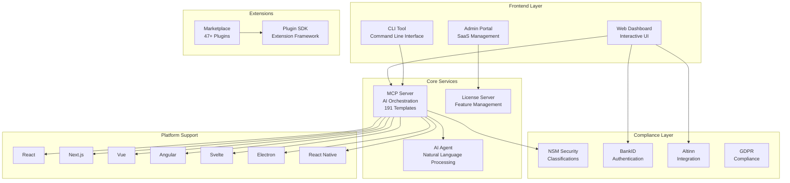
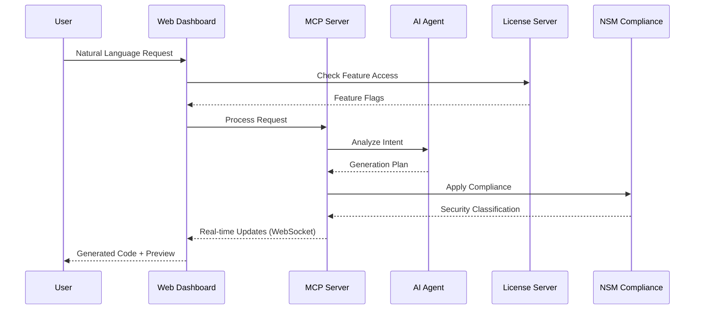
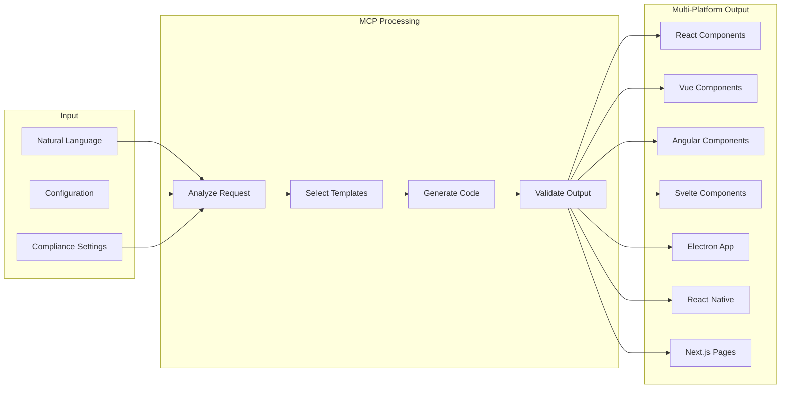
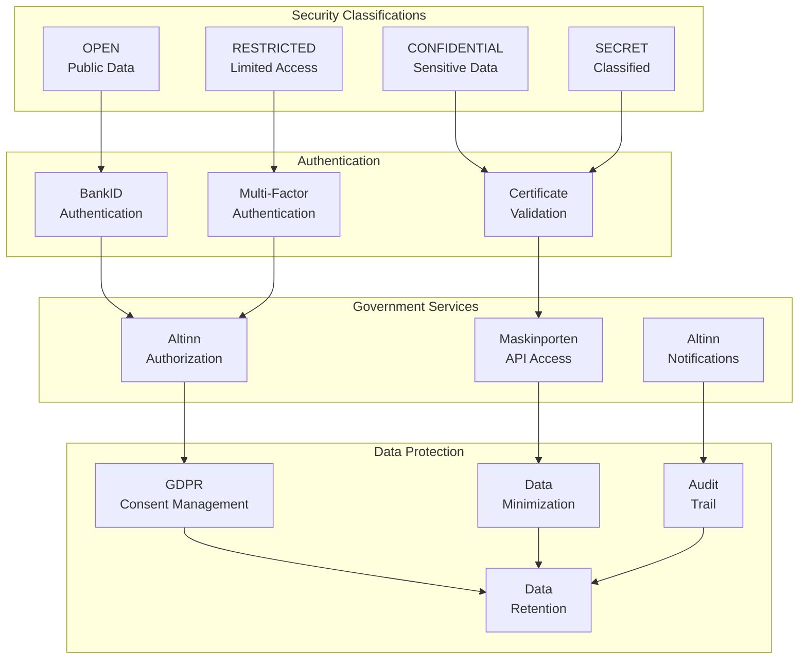
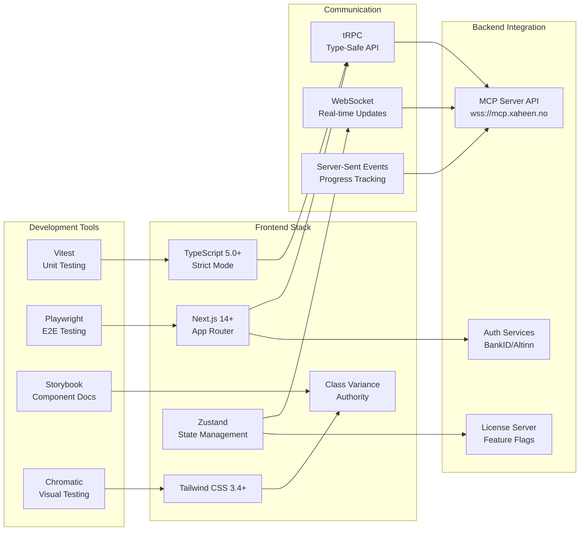
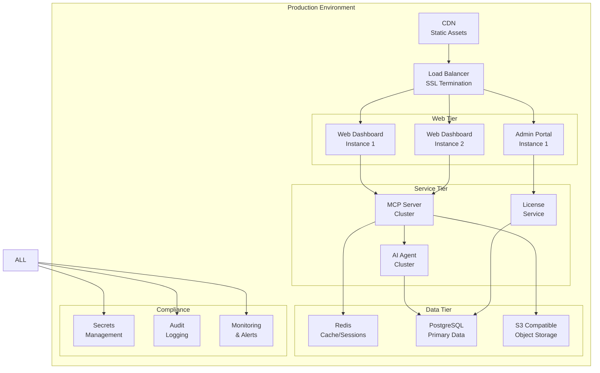
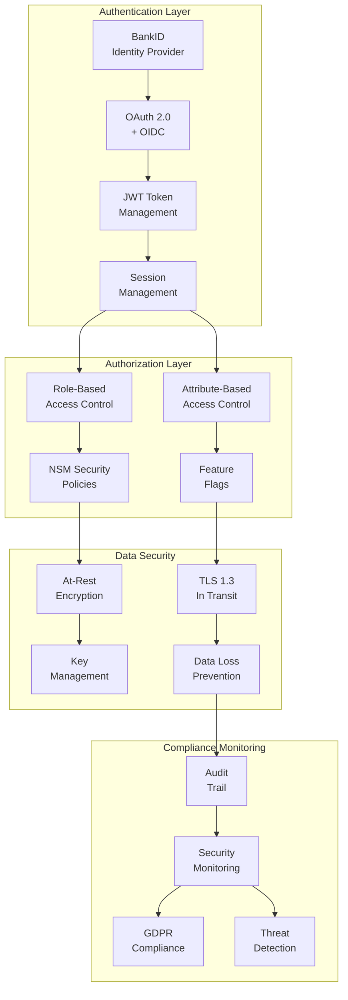
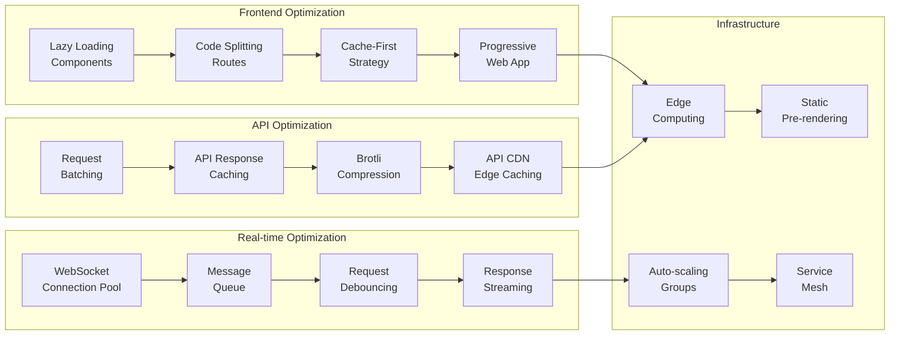
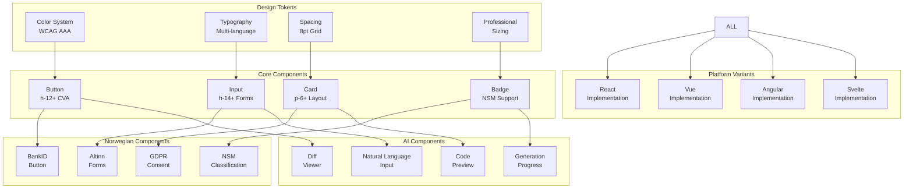

# Xaheen CLI Ecosystem Architecture Diagrams
## Complete Platform Architecture Visualization

### 1. High-Level Ecosystem Architecture



### 2. Data Flow Architecture



### 3. Component Generation Flow



### 4. Norwegian Compliance Architecture



### 5. Web Dashboard UI Architecture

```mermaid
graph TB
    subgraph "Header"
        LOGO[Logo]
        SEARCH[Global Search]
        NOTIFICATIONS[Notifications]
        USER[User Menu]
    end
    
    subgraph "Sidebar"
        NAV[Navigation]
        QUICK[Quick Actions]
        STATUS[Platform Status]
    end
    
    subgraph "Main Content"
        subgraph "Dashboard"
            METRICS[Ecosystem Metrics]
            AI_PANEL[AI Assistant]
            ACTIVITY[Recent Activity]
        end
        
        subgraph "Project Creation"
            WIZARD[Multi-Step Wizard]
            PREVIEW[Code Preview]
            CONFIG_VAL[Config Validation]
        end
        
        subgraph "Management"
            PROJECTS[Project List]
            PLUGINS[Plugin Manager]
            SETTINGS[Settings]
        end
    end
    
    subgraph "Compliance Panel"
        NSM_STATUS[NSM Classification]
        GDPR_STATUS[GDPR Status]
        AUDIT_LOG[Audit Trail]
    end
    
    SEARCH --> AI_PANEL
    NAV --> Dashboard
    NAV --> Project Creation
    NAV --> Management
    QUICK --> WIZARD
    AI_PANEL --> PREVIEW
    CONFIG_VAL --> NSM_STATUS
```

### 6. Technology Stack Architecture



### 7. Deployment Architecture



### 8. Security Architecture



### 9. Performance Optimization Architecture



### 10. Component Library Architecture



---

## Implementation Notes

These architecture diagrams provide a comprehensive view of the Xaheen CLI Ecosystem, illustrating:

1. **Complete ecosystem integration** - How all components work together
2. **Data flow patterns** - Request processing and real-time updates
3. **Multi-platform architecture** - Support for 7 different frameworks
4. **Norwegian compliance** - NSM, BankID, Altinn integration
5. **Security architecture** - Authentication, authorization, and data protection
6. **Performance optimization** - Caching, lazy loading, and edge computing
7. **Component library structure** - Design tokens to platform-specific implementations

Each diagram can be rendered using Mermaid.js in documentation tools or viewed in compatible markdown editors.